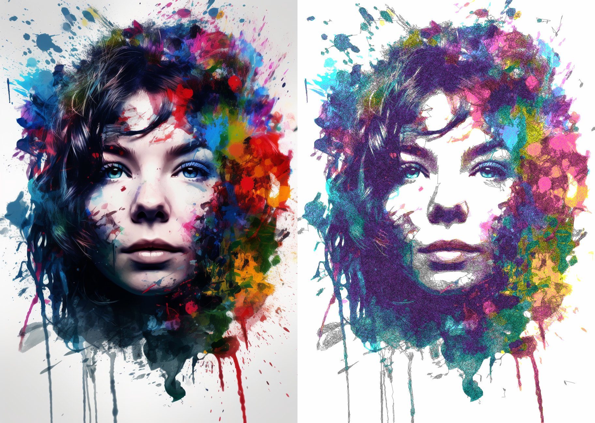

.. _cmyk-separation:

======================
CMYK Separation
======================

*Before + After CMYK Separation*

CMYK Separation is the process of splitting an image into representations of Cyan / Magenta / Yellow / Key (Black).
These split images are then processed separately and re-combined to produce representation of the source image using only four pen colours!

DrawingBotV3 allows you to automate the CMYK splitting process and will automatically split the image for you and pass each image into the selected :ref:`Path Finding Module <pfms>`, all PFMS are supported. The final plot will be made up of 4 layers one for each CMYK pen.

-----

How to use
-------------

1) To activate CMYK go to the **Pen Settings** panel and change **Colour Separation** to **CMYK** or select the **CMYK Separation** Special Drawing Set.
2) A dialog will appear asking you if you wish to apply the recommended settings, hit **Apply**. This will activate a Special Drawing Set which has all of the CMYK colours already configured & also activate the *Darken* blend mode.
3) You then will need to press **Start Plotting** again to generate the final plot.
4) You can then also use the **Configure** button to change the multiplier for each pen to achieve the perfect weighting of colours. It's best to change these values after you've made an initial plot with your own pens so you can judge the colour balance properly.

Notes
^^^^^^
The rendering you see in the viewer is only a representation and may differ from the final plot. Some experimentation may be needed to achieve a good balance of CMYK. It is strongly recommended that you specify the drawing areas size and active **Rescale to Pen Width**
