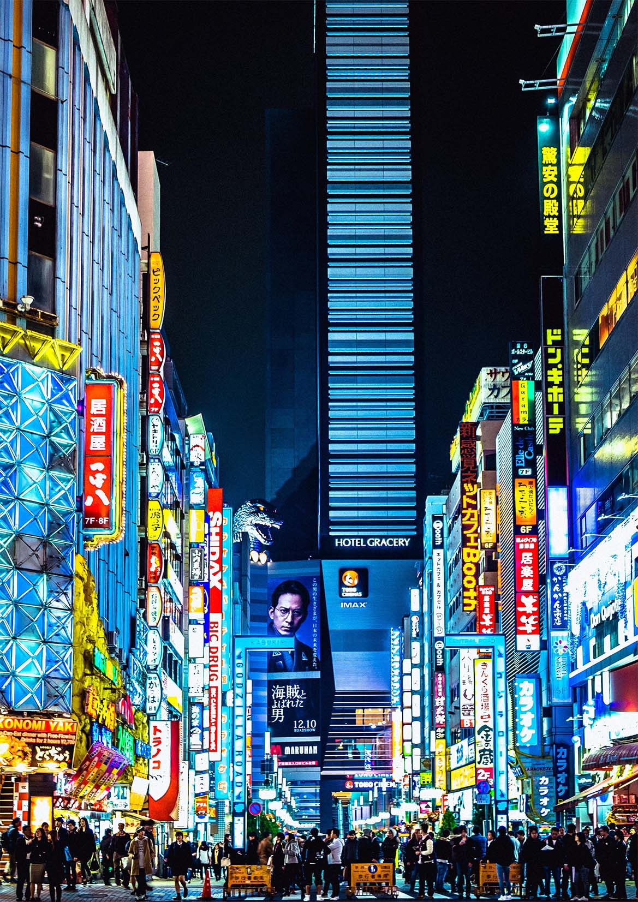
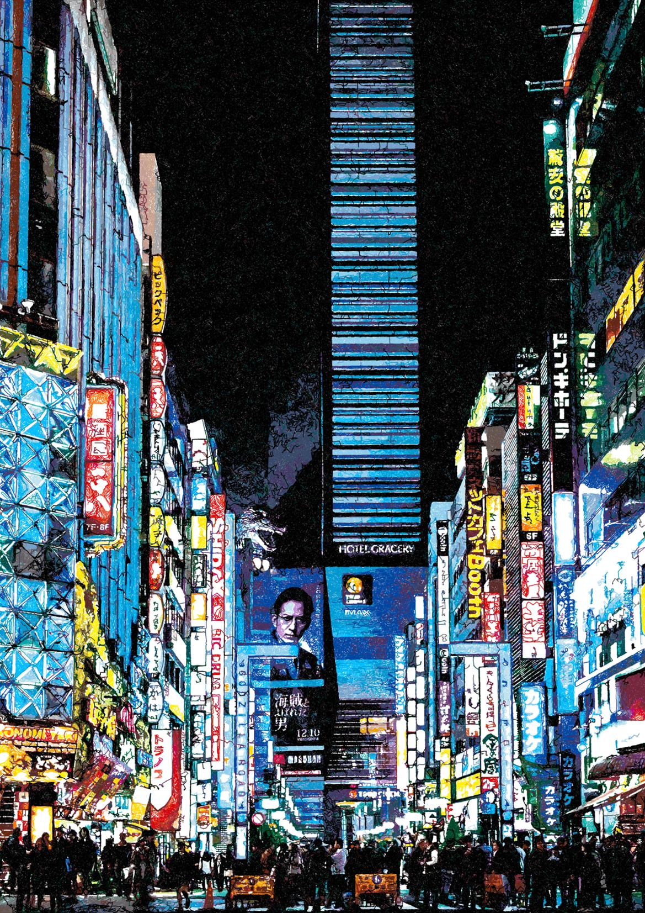

.. _colour-match:

======================
Colour Match
======================

*Before + After Colour Match Using 60 Staedtler FineLiners*

Colour Match allows you to represent the colours in the original image using pens of your choice.

The feature can be used with any PFM to create loads of interesting results!

Using :ref:`cmyk-separation` is also a good option to generate drawings which match the colours in the original image.

-----

How to run 'Colour Match'
-------------------------

1) To activate Colour Match go to the **Pen Settings** panel and change **Colour Separation** to **Colour Match**.
2) Next add all of the pens you wish to use, the more colours the better, though you can also be creative here and use only a small range of colours combined with blacks and grey to create more stylised drawings.
3) Then press **Start**, Colour Match will first compare each pen to original image and then start plotting.

Options
-------------
You also have a few options to configure colour match further, found to the right of the Colour Separation drop-down.

- **Colour Accuracy** - Increasing the Colour Accuracy will increase the quality of the colour match and prevent pens drawing over areas if they are a bad colour match, generally 95% provides the best results. Colour Accuracy relates to a Delta-E colour measurement in the following way
    - 100: No colour difference
    - 99: Slight colour difference
    - 98: Small colour difference
    - 97: Medium colour difference
    - 96: Large colour difference
    - 95: Very large colour difference
- **Brightness Multiplier** - Decreases the overlap of the pens in the image
- **Smooth Distribution** - Uses a different Algorithm to find the start point for each shape which results in a more even distribution of pens across the entire image, only affects Sketch PFMs
- **Pen Limit** - Limits the number of pens which can be used when matching, if this value is set to 18, only the 18 best matched pens will be used. If this value is set to 0, there is no limit.
- **Use Canvas Colour** - Adds an invisible pen which matches the colour of the Canvas, helps to avoid drawing unnecessary lines.
- **Line Density** - from Sketch PFMs” - the line density control found in the Sketch PFMs can also be used to control the Colour Match output.

Tips for using the "Colour Match" feature
-----------------------------------------------
- Use a bright, saturated image, murky images or ones with a limited colour palette may perform poorly.
- Use all the pens of a specific manufacturer, i.e. Use the presets for the set of 60 Staedtler Fineliners, then use the Pen Limit feature, to limit selection to approx 18+ pens allowing colour match to choose your best matched pens for each plot.
- Use as many pens as you can, the more pens you use the better matched the colours will be.

