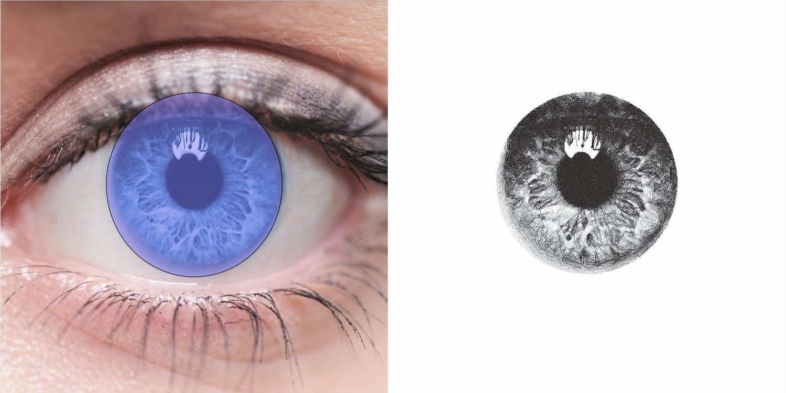

.. _mask-settings:

#########################
Mask Settings
#########################

Settings panel allows you to mask areas of the image, you can add various shapes mask, you can move, resize, rotate, skew with the controls in the viewport area.

You can also import custom masks as SVGs, they will keep their original sizing so you can create detailed masks by importing an SVG with the same dimensions as in drawing area controls.

**Note:** Masks will increase the processing time and complex masks may cause the PFM to take a long time to process or fail to process.

*e.g. Fig 1. The masks as configured in DrawingBotV3 - Fig 2. The Final Drawing*

***********************
Select
***********************

When active Masks can be selected in the viewport and move, resize, rotate, skew.

When selected a mask can be in **Scale Mode** or **Rotate Mode**

You can tell the mode apart by the shapes drawn at the corners of the shape, in **Scale Mode** the shape's handle will be squares, in **Rotate Mode** the shape's handles will be circles.

Moving Masks
======================

Select the mask and hold left click to drag it around the viewport, release Left Click to confirm or ESC to cancel.

You can also move masks in 1mm increments with the arrow keys (LEFT, RIGHT, UP, DOWN).

**Shift Down:** When the Shift Key is held, the mask will only move on one axis.

Resizing Masks
======================

Enter **Scale Mode** by clicking the shape until the handles on the corners are squares.

Hold Left Click on one of the handles to resize the shape, release Left Click to confirm or ESC to cancel.

**Shift Down:** When the Shift Key is held, the mask will be resized from the centre.

**Ctrl Down:** When the Ctrl Key is held, the mask will be resized uniformly.

If `Grid Snapping`_ is enabled, the resizing will move in 1mm increments.

Accurate Resizing
======================

Select the Mask you wish to resize precisely.

At the bottom of the Mask Settings panel you'll find the text fields for X,Y,W,H (Start X, Start Y, Width, Height), change these settings to resize the selected mask.

Once selected the settings at the bottom of the Mask Settings panel will no longer be grayed out.

Here you can define an exact size for the mask, specifying the Start X / Start Y (**X**, **Y**) and Width / Height (**W**, **H**) of the mask

Rotating/Skewing Masks
======================

Enter **Rotate Mode** by clicking the shape until the handles on the corners are circles.

**Rotating:** Hold Left Click and drag any of the corner handles of the shape to rotate the mask, release Left Click to confirm or ESC to cancel.

**Skewing:** Hold Left Click and drag any of the edge handles of the shape to skew the mask, release Left Click to confirm or ESC to cancel.

**Shift Down:** When the Shift Key is held, the mask will be rotated/skewed around the handle opposite the current one, the red marker indicates the anchor point being used.

**Ctrl Down:** When the Ctrl Key is held, the mask will be rotated in 15 degree increments, currently has no effect on skew.

***********************
Edit
***********************

When active individual vertices which make up each mask can be edited in the viewport, giving you a finer level of control, especially useful if you want to edit custom masks created with the `Draw`_ tool

***********************
Draw
***********************

When active you can draw your your own custom mask in the viewport out of lines or bezier curves.

***********************
Grid Snapping
***********************

When enabled masks will snap to 1mm increments when dragged around.

***********************
Soft Clip
***********************

A special setting which effects the inner processing of the Path Finding Module used.

Some path finding modules support "Soft Clipping" where some shapes may touch or fully overlap the edges of the mask but the Path Finding Module will direct them to avoid the masked out area.

Soft Clip can result in some more organic looking masks whereas with it disabled shapes will be clipped sharply at the end of the mask.

***********************
Mask Controls
***********************

Here the controls you will find in the **Mask Settings** panel.

 - **Enable Masking**: When disabled all the masks will be bypassed completely and the settings will be grayed out.
 - **Display Masks**: Controls the visibility of masks, when disabled no masks will be visible.

For each mask you'll see the following details.

 - **Enable** - a checkbox which allows you to bypass specific masks.
 - **Name** - the name for the mask, defaults too the mask's shape.
 - **Type** - the type of the mask, controls what effect the mask has on the drawing, there are the following options.
    - **Add:** If only *Add* masks exist, the drawing will only draw within the *Add* masks. If there are also *Subtract* masks, the *Add* will be performed first, and the *Subtract* masks may then remove from the *Add* masks
    - **Subtract:** If only *Subtract* masks exist, the drawing occupy the area not covered by masks. If there are also *Add* masks, the *Subtract* masks will take priority, and anything covered by a *Subtract* mask will not be included in the drawing.

There are some buttons at the bottom of the **Mask Settings** panel, some of these options can also be accessed by right-clicking a specific mask.

 - **Add (Plus)** - Creates a new mask, the following types are available
    - Rectangle - Adds a rectangular mask
    - Circle - Adds a circular mask
    - Star - Adds a star shaped mask
    - X - Adds an "X" shaped mask
    - SVG - Adds an SVG Mask, complex SVGs may fail to open as masks, the SVG should consist of only closed shapes and no paths. SVGs generated with DrawingBotV3 can also be used.
 - **Delete (Minus)** - Deletes the selected mask, will be grayed out if no version is selected.
 - **Duplicate (Eye)** - Duplicates the selected mask.
 - **Move Up (Up Arrow)** - Moves the selected mask one position up in the list.
 - **Move Down (Down Arrow)** - Moves the selected mask one position down in the list.
 - **Invert Masks (Swap Arrows)** - Swaps the mask types so ADD -> SUBTRACT & SUBTRACT -> ADD
 - **Clear Versions (Reset Arrow)** - Deletes all of the current masks, clearing the list.

***********************
Undo / Redo
***********************

Masks Settings support ``Ctrl + Z`` and ``Ctrl + Shift + Z`` to undo/redo specific actions, make sure the viewport is highlighted for the action to be registered.