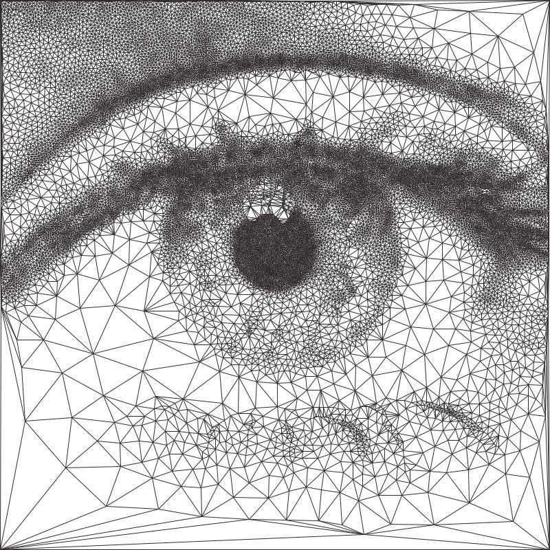

.. _pfms:

======================
Path Finding Modules
======================

The Path Finding Modules (PFMs) are algorithms for converting images into geometric shapes, they can be configured in the **Path Finding Controls** panel.
They have been designed to be as flexible as possible and to run with almost any combination of settings. This means that they can create many more styles than those you see here. Some of these extra styles are included as **presets**!

Every Path Finding Module can also be run with :ref:`cmyk-separation`

------

Sketch PFMs
----------------------------------------------------

Lines
^^^^^^
Transforms an image into lines using brightness data.

.. image:: images/sketch_lines_eye_after.jpg
    :width: 250pt

.. image:: images/sketch_lines_after.jpg
    :width: 250pt

Curves
^^^^^^
Transforms an image into `catmull-rom splines <https://en.wikipedia.org/wiki/Centripetal_Catmull%E2%80%93Rom_spline>`_ using brightness data.

.. image:: images/sketch_curves_eye_after.jpg
    :width: 250pt

.. image:: images/sketch_curves_after.jpg
    :width: 250pt

Squares
^^^^^^^^^^^^
Transforms an image into lines in a rectangular pattern using brightness data.

.. image:: images/sketch_squares_eye_after.jpg
    :width: 250pt

.. image:: images/sketch_squares_after.jpg
    :width: 250pt

Sobel Edges
^^^^^^^^^^^^
Transforms an image into lines using brightness data & edge detection data. By using a `Sobel Operator <https://en.wikipedia.org/wiki/Sobel_operator>`_ to find sharp edges and then using this data in conjunction with the brightness to find the next line.

.. image:: images/sketch_sobel_edges_eye_after.jpg
    :width: 250pt

.. image:: images/sketch_sobel_edges_after.jpg
    :width: 250pt

How they work
^^^^^^^^^^^^^^

1) Find the darkest area of the image
2) Find the darkest pixel in that area
3) Finds the next darkest line from that pixel
4) Brighten the part of the image that the line covers
5) Repeat steps 2 to 4 until the specified **squiggle length** is reached then return to step 1

The process will stop when either the specified **line density** or **max line limit** has been reached.

Settings: *All*
^^^^^^^^^^^^^^^^
- **Plotting Resolution**: the factor the original image is scaled by before plotting. Useful in reducing the number/density of lines, also decreased computation time.
- **Random Seed**: used to generate all the random numbers used by the PFM. This means plots will always produce the same results.
- **Line Density**: affects the total number of lines and therefore the computation time
- **Min Line Length**: the minimum length of each line
- **Max Line Length**: the maximum length of each line
- **Max Line Limit**: limits the total number of lines, will only have an effect if this limit is reached before the chosen **line density**
- **Squiggle Length**: defines the total number of connected lines which should be drawn before looking for the next darkest area of the image
- **Adjust Brightness**: the amount to change the pixel's brightness by in the source image when a line is drawn, affects how often the PFM will draw over the same area.
- **Neighbour Tests**: how many drawing angles to test before choosing the darkest line, increase this value to improve the accuracy of the plot, this will increase computation time.
- **Should lift pen**: if the pen should be raised when moving to the next darkest area, disabling this can create some unique styles

Settings: *Lines & Curves Only*
^^^^^^^^^^^^^^^^^^^^^^^^^^^^^^^

- **Start Angle *(Min & Max)***: the start angle affects the trajectory of lines, this has less effect when **shading** is disabled.
- **Shading**: when shading is enabled the PFM will draw lines which are limited by the **start angle min/max** creating a diagonal shading effect
- **Shading Threshold**: the point in the processing when shading will kick in, note this ignores **max line limit**
- **Drawing Delta Angle**: the degrees of rotation that the PFM will use when finding the next line while drawing
- **Shading Delta Angle**: the degrees of rotation that the PFM will use when finding the next line while shading

Settings: *Curves Only*
^^^^^^^^^^^^^^^^^^^^^^^^^^^^^^^

- **Curve Tension**: affects the tension of the catmull-rom splines

Settings: *Sobel Edges Only*
^^^^^^^^^^^^^^^^^^^^^^^^^^^^^^^

- **Sobel Intensity**: the priority of edge detection vs brightness
- **Sobel Adjust**: similar to **adjust brightness**, the amount to decrease a pixel's sobel value by when a line is drawn over it, affects how strongly the PFM is affected by the sobel values.

------

Spiral PFM
---------------------
Transforms an image into a oscillating spiral using brightness data.

.. image:: images/spiral_eye_after.jpg
    :width: 250pt

.. image:: images/spiral_after.jpg
    :width: 250pt

How it works
^^^^^^^^^^^^^^^^^^^^^^^^^^^^^^^
1) Moves to the first point on the spiral.
2) Samples the brightness at the current point and draws a line which is perpendicular to the spiral where the lines length is proportional to the sampled brightness.
3) Move to the next point on the spiral and Repeat step 2.

The process stops when the specified **spiral size** has been reached

Settings
^^^^^^^^^^^^^^^^^^^^^^^^^^^^^^^
- **Plotting Resolution**: the factor the original image is scaled by before plotting. Useful in reducing the number/density of lines, also decreased computation time.
- **Random Seed**: used to generate all the random numbers used by the PFM. This means plots will always produce the same results.
- **Spiral Size**: the size of the generated spiral, a spiral at 100% will just touch the edge of the image.
- **Centre X**: the x position of the centre point of the spiral as a percentage.
- **Centre Y**: the y position of the centre point of the spiral as a percentage.
- **Ring Spacing**: the distance between each generated ring
- **Amplitude**: the scale of the oscillations
- **Density**: *may change* a large density will result in less lines / brightness samples

------

Voronoi PFMs
------------------------------------------------------------
All Voronoi PFMs utilise a `Weighted Voronoi Diagram <https://en.wikipedia.org/wiki/Weighted_Voronoi_diagram>`_ to determine the distribution of brightness in the original image and then use this diagram to generate new styles.

Circles
^^^^^^^^
Transforms an image into a series of inscribed circles for each cell of the voronoi diagram.

.. image:: images/voronoi_circles_eye_after.jpg
    :width: 250pt

.. image:: images/voronoi_circles_after.jpg
    :width: 250pt

Triangulation
^^^^^^^^^^^^^^^^
Transforms an image into a series of connected triangles joining all the *centroids* in the voronoi diagram using `Delaunay Triangulation <https://en.wikipedia.org/wiki/Delaunay_triangulation>`_

.. image:: images/voronoi_triangulation_after.jpg
    :width: 250pt

Stippling
^^^^^^^^^^^^^^^^
Transforms an image into a series of filled circles for each *centroid* in the voronoi diagram, the size of the "stipple" is relative to the sampled brightness of the cell the centroid belongs to.

.. image:: images/voronoi_stippling_eye_after.jpg
    :width: 250pt

.. image:: images/voronoi_stippling_after.jpg
    :width: 250pt

Diagram
^^^^^^^^^^^^^^^^
Transforms an image into a Voronoi Diagram

.. image:: images/voronoi_diagram_eye_after.jpg
    :width: 250pt

.. image:: images/voronoi_diagram_after.jpg
    :width: 250pt

How they work
^^^^^^^^^^^^^^^^^^^^^^^^^^^^^^^
1) Randomly scatter points over the image proportional to the images brightness
2) Calculates a voronoi diagram based on these points.
3) Calculates the weighted centroids of each cell in the diagram using brightness data.
4) Use the generated centroids to re-calculate the voronoi diagram.
5) Return to step 3

The process finishes when the specified number of **voronoi iterations** have been performed.

Settings: *All*
^^^^^^^^^^^^^^^^^^^^^^^^^^^^^^^
- **Plotting Resolution**: the factor the original image is scaled by before plotting. Useful in reducing the number/density of lines, also decreased computation time.
- **Random Seed**: used to generate all the random numbers used by the PFM. This means plots will always produce the same results.
- **Point Count**: the number of cells of the underlying voronoi diagram / how many points to scatter in step 1.
- **Luminance Power**: used when randomly scattering points over the image, it affects how bias the scattering is towards darker areas of the image, typically using the same value for Density Power yields the best results.
- **Density Power**: used when calculating the centroids of the voronoi diagram, it affects the calculation's bias towards darker areas of the image, typically using the same value for Luminance Power yields the best results.
- **Voronoi Iterations**: how many times to re-calculate the voronoi diagram, more iterations will result in a more accurate representation of the original image.

Settings: *Circles Only*
^^^^^^^^^^^^^^^^^^^^^^^^^^^^^^^
- **Circle Size**: the fill percentage of each circle where 100% is the largest circle which still fits within it's voronoi cell.

Settings: *Triangulation Only*
^^^^^^^^^^^^^^^^^^^^^^^^^^^^^^^
- **Triangulate Corners**: when enabled the PFM will add triangles which connect the corners of the image to the other points

Settings: *Stippling Only*
^^^^^^^^^^^^^^^^^^^^^^^^^^^^^^^
- **Stipples Size**: the fill percentage of each stipple where 100% is the maximum size of the stipple relative to the image's brightness

