.. _pfms:

#########################
Path Finding Modules
#########################

The Path Finding Modules (PFMs) are algorithms for converting images into geometric shapes, they can be configured in the **Path Finding Controls** panel.
They have been designed to be as flexible as possible and to run with almost any combination of settings. This means that they can create many more styles than those you see here. Some of these extra styles are included as **presets**!

Every Path Finding Module can also be run with :ref:`cmyk-separation` and :ref:`colour-match`

***********************
Sketch PFMs
***********************

Sketch PFMs are best used for plots using multiple layers of different pens as the Sketch PFMs rely on the different pens to represent the different tones in the image. However, it is possible to use a single pen with Sketch PFMs though it is recommended to use a pen which is additive where overlapping strokes will result in progressively darker lines.

How do they work?
================================

1) Find the darkest area of the image
2) Find the darkest pixel in that area
3) Finds the next darkest line/curve from that pixel
4) Brighten the part of the image that the line covers
5) Repeat steps 2 to 4 until the specified :term:`Squiggle Max Length` is reached then return to step 1

The process will stop when either the specified :term:`Line Density` or :term:`Line Max Limit` has been reached.

Sketch Lines
======================
Transforms an image into lines using brightness data.

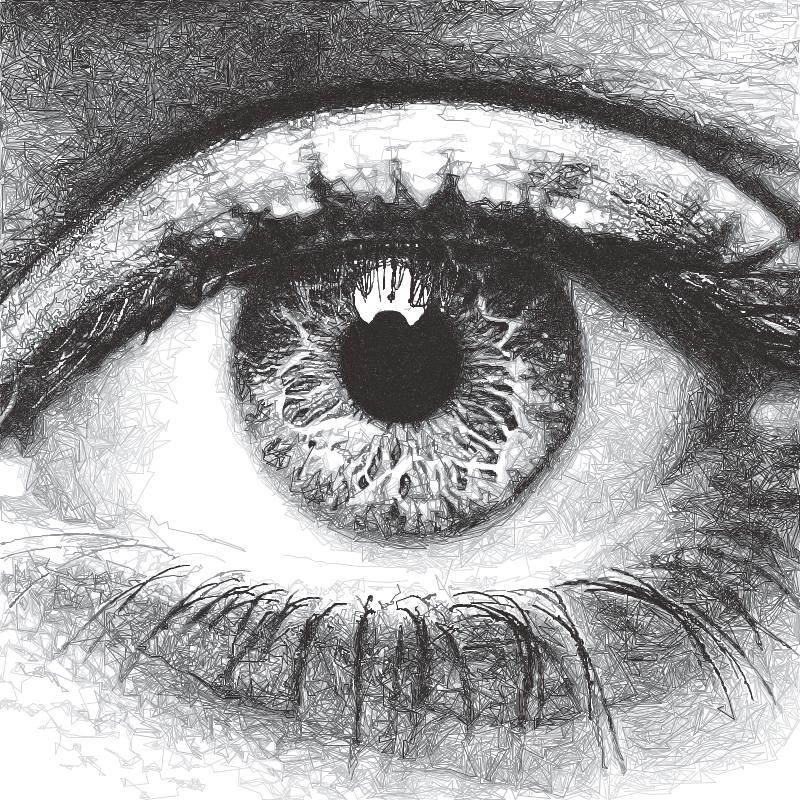

Settings
----------

Default
^^^^^^^^^^^

.. glossary::

    Plotting Resolution
    ``Values: Number (Safe Range: 0.1 -> 1.0)``

        Controls the resolution of the image used by the PFM but doesn't change the size of the pen to be used, this is available on almost every PFM!

        This is a quick way to increase/decrease the visual quality & density of a drawing and also decrease computation time.

        .. image:: images/sketch/plotting_resolution_comparison_v1.jpg
            :height: 150pt

        *e.g. Fig 1. Plotting Resolution = 0.2, Fig 2. Plotting Resolution = 0.4, Fig 3. Plotting Resolution = 0.7*

        **Quick Tip:** You can also enter values higher than the Safe Range, for example using (1.0 -> 1.5) may be enough to get the density you're aiming for

    Random Seed
        ``Values: Number``

        Used to generate all the random numbers used by the PFM. If you use the same Random Seed the PFM will produce the same results when given the same image.

        **Quick Tip:** Created a good style but the lines aren't falling in quite the right way? Adjust the random seed and to alter the positions of the generated lines.

----

Style
^^^^^^^^^^^

The style portion of the Sketch PFM settings are great for applying a specific creative style to the generated paths.
The majority of the style sliders affect the path processing only and not the original bitmap image.

The values don't need to add up 100% the balance between all of them decides the weighting of what to emphasise.
e.g :term:`Directionality` of 100% and a :term:`Luminance Power` of 100%, means that the paths will be 50% driven by the luminance of the image and 50% by the :term:`Directionality`.

.. glossary::

 Should Lift Pen
        ``Values: Boolean (True | False)``

        When **True**, the pen will be lifted in-between Squiggles.

        When **False**, the PFM will never lift the pen from the paper.

 Directionality
        ``Values: Number (Safe Range: 0 -> 100)``

        Forces the lines to follow the natural contours of the image by pushing the Path Finding process towards the direction of lowest variance.

        .. image:: images/style/directionality_comparison_v1.jpg
            :width: 400pt

        *e.g. Fig 1. Directionality = 0, Fig 2. Directionality = 100 - You can see in this example the paths on the right tend to follow the curves of the original image more carefully and don't fall outside of the shapes as often*

 Clarity
        ``Values: Number (Safe Range: 0 -> 100)``

        Controls a sharpness of the input image, and automatically applies an Unsharp Mask before processing the image.

        .. image:: images/style/clarity_comparison_v1.jpg
            :width: 400pt

        *e.g. Fig 1. Clarity = 0, Fig 2. Clarity = 100*

 Distortion
        ``Values: Number (Safe Range: 0 -> 100)``

        Adds some random noise to the generated lines, creating more stylised images.

        .. image:: images/style/distortion_comparison_v1.jpg
            :width: 400pt

        *e.g. Fig 1. Distortion = 0, Fig 2. Distortion = 100*

 Angularity
        ``Values: Number (Safe Range: 0 -> 100)``

        Controls the frequency at which lines are allowed to change direction, a higher angularity results in lines which don’t change direction as frequently and cut across the image in more stylised ways.

        .. image:: images/style/angularity_comparison_v1.jpg
            :width: 400pt

        *e.g. Fig 1. Angularity = 0, Fig 2. Angularity = 50*

 Edge Power
        ``Values: Number (Safe Range: 0 -> 100)``

        Pushes the Path Finding process to edges detected by Canny Edge Detection, which is very accurate and will highlight sharp edges, keeping more detail in the image.

        .. image:: images/style/edge_power_comparison_v1.jpg
            :width: 400pt

        *e.g. Fig 1. Edge Power = 0, Fig 2. Edge Power = 100*

 Sobel Power
        ``Values: Number (Safe Range: 0 -> 100)``

        Similar to Edge Power but uses a Sobel Edge Filter instead of Canny Edge Detection, which results in less accurate edges and creates an exaggerated cartoonish quality on the plot.

        .. image:: images/style/sobel_power_comparison_v1.jpg
            :width: 400pt

        *e.g. Fig 1. Sobel Power = 0, Fig 2. Sobel Power = 100*

 Luminance Power
        ``Values: Number (Safe Range: 0 -> 100)``

        Luminance Power is what typically drives the Path Finding Process so should usually be left at 100%, and the other style sliders should be introduced bit by bit.
        Typically PFMs will follow dark areas in the image when creating lines, this slider can be used to decrease the influence of brightness which in turn will favour other style options like Directionarity or Edge Power etc.

 Drawing Delta Angle
        ``Values: Number (Range: -360 -> 360)``

        Controls the directions that the PFM can travel during the Path Finding Process.

----

Segments
^^^^^^^^^^^

.. glossary::

    Line Density
        ``Values: Percentage (Range: 0 -> 100)``

        Affects the total number of segments in the final drawing and therefore the computation time. This setting drives the progress bar and when it reaches 100% processing stops.

        :math:`progress = (avgLuminance - initialLuminance) / (desiredLuminance - initialLuminance)*lineDensity`

        **Quick Tip:** Reducing the Displayed Shapes slider above the viewport has the same effect as decreasing the :term:`Line Density`. So if the density is too high you can reduce it later.

    Line Min Length

        ``Values: Number (Safe Range: 2 -> 500)``

        The minimum length of each segment, see :term:`Line Max Length` for more details.

    Line Max Length
        ``Values: Number (Safe Range: 2 -> 500)``

        The maximum length of each segment, :term:`Line Min Length` defines the minimum.

        Decreasing the Min/Max Length will increase the detail retention in the final plot as each segment will be more accurate.

        Increasing the Min/Max Length will increase the length of generated lines and decrease the accuracy of the final plot.

    Line Max Limit

        ``Values: Number (Safe Range: -1 -> 1000000)``

        Limits the total number of segments. Will only have an effect if this limit is reached before the chosen :term:`Line Density`.

        When the Max Limit is -1, the limit will be ignored.

    Angle Tests

        ``Values: Number (Safe Range: 1 -> 360)``

        Controls the accuracy of the generated lines. When finding the next segment the PFM will generate new segments travelling in different directions and then compare them. The Angle Tests controls the number of new segments to generate at each position.

        **Quick Tip:** This control can also be used creatively, try setting it to 3, 4 or 6. You'll see the PFM generate Triangles, Squares and Hexagonal Lines.

    Unlimited Tests
        ``Values: Boolean (True | False)``

        Will run as many angle tests as required to find the “best” line possible, resulting in more accurate drawings with longer processing times.

----

Squiggles
^^^^^^^^^^^^^^^^^^^^^^

A path of segments(lines/curves) is called a squiggle. Each squiggle is continuous and doesn't include any pen lifts.

You can use this area of the PFM to reduce the plotting time of sketches generated but at the trade-off of losing smaller details and potentially having squiggles crossing bright areas of the source image.

Shorter Squiggles = Longer Plotting Time & Higher Quality Output
Longer Squiggles = Shorter Plotting & Lower Quality Output

.. glossary::

    Squiggle Min Length
        ``Values: Number (Safe Range: 0 -> 5000)``

        Defines the minimum number of segments for each squiggle, setting a minimum length prevents incredibly short squiggles from being created, shortening plotting times.

        e.g. Squiggle Min Length = 100, every squiggle would consist of at least 100+ segments.

    Squiggle Max Length
        ``Values: Number (Safe Range: 0 -> 5000)``

        Defines the cut-off for the maximum number of segments allowed in each squiggle. Once the squiggle has reached the max length the pen will be lifted and move to a new location.

        Increasing the Max Length will decrease the plotting time, but may create a poor distribution of tones.

    Squiggle Max Deviation

        ``Values: Percentage (Safe Range: 0 -> 100)``

        Control how far a squiggle is allowed to deviate in brightness before it is ended prematurely. This has the result of making shorter squiggles which are more accurate and less likely to cross over brighter areas of the image. Increasing the allowed deviation will result in a less accurate drawing with fewer pen lifts.

        If you notice your drawing has lines crossing bright areas of the image that you wish to remove, you can try lowering the Max Deviation and lowering the Squiggle Min Length.

        .. image:: images/sketch/squiggle_deviation_comparison.jpg
            :width: 500pt

        *e.g. Fig 1. Squiggle Max Deviation = 5, Fig 2. Squiggle Max Deviation = 1000 - The green lines show the plotter's travel while the pen is up. The overall distance of the plot changed by a few metres, and the number of pen lifts was dramatically reduced. The default Squiggle Max Deviation of 25 provides a good middle-ground, keeping quality while not having too many pen lifts.*

----

Erasing
^^^^^^^^^^^^^^^^^^^^^^

Sketch PFMs use a Lightened Image to keep track of the areas which have been drawn over. When a line is drawn it is erased from the Working Image, so when the same area is next considered, lines will be less likely to cross over.

You can view the Lightened Image in your viewport by going to "Display / Lightened" after the drawing has finished processing.

    .. image:: images/sketch/erase_drawing_comparison_v1.jpg
        :width: 500pt

    *e.g. Fig 1. Original Image, Fig 2. Lightened/Erased Image, Fig 3. Sketch Lines Result*

.. glossary::

    Erase Min

        ``Values: Number (Range: 0 -> 255)``

        Controls the minimum intensity of the __`Erasing` process, see :term:`Erase Max` for more details.

    Erase Max

        ``Values: Number (Range: 0 -> 255)``

        Controls the maximum intensity of the __`Erasing` process, with :term:`Erase Min` defining the minimum.

        Erase Min/Max alters the amount to brighten each RGB channel in the Lightened Image.

        It therefore controls the overall plot density & contrast in the image and can be fine-tuned to your specific pens.

        The :term:`Tone` setting alters the interpolation between these two values.

        .. image:: images/sketch/erase_max_comparison_v1.jpg
            :width: 500pt

        *e.g. Fig 1. Erase Min = 50 & Erase Max = 50, Fig 2. Erase Min = 50 & Erase Max = 125 (Default), Fig 3. Erase Min = 50 & Erase Max = 255*

        **Quick Tip:** Are your Physical Plots coming out too dense and soaking the paper?

        Try increasing the Erase Min/Max to reduce the amount of overlap.

    Erase Radius Min

        ``Values: Number (Range: 0 -> 50)``

        Controls the minimum radius of the shapes drawn by the __`Erasing` process, see :term:`Erase Radius Max` for more details.

    Erase Radius Max
        ``Values: Number (Range: 0 -> 50)``

        Controls the maximum radius of the __`Erasing` process, with :term:`Erase Radius Min` defining the minimum.

        It therefore controls the spread of shapes in the image and the overall plot density.

        The :term:`Tone` setting alters the interpolation between these two values.

        **Quick Tip:** Are you wanting to plot with a single pen? Increasing the Erase Radius Max is a great way to introduce contrast back into the drawing.

        .. image:: images/sketch/erase_radius_comparison_v1.jpg
            :width: 500pt

        *e.g. Fig 1. Original Image, Fig 2. Lightened/Erased Image, Fig 3. Sketch Lines Result - The "Digital" Preset was used with Erase Min = 1, Erase Max = 24*

    Tone
        ``Values: Percentage (Range: 0 -> 100)``

        Controls the contrast of the _`Erasing` process, by controlling a tone curve between the :term:`Erase Min` / :term:`Erase Max`  & :term:`Erase Radius Min` / :term:`Erase Radius Max`.

        Using a higher Tone will result in an image with a stronger contrast, with more overlap and less spacing between lines.

        Note: The tone slider has no effect when the Erase Values are identical.

        .. image:: images/sketch/erase_tone_comparison_v1.jpg
            :width: 500pt

        *e.g. Fig 1. Tone=0, Fig 2. Tone=50, Fig 3. Tone=100 - The "Sketchy" Preset was used with Erase Min=50, Erase Max=125, Erase Radius Min=1.0, Erase Radius Max=6.0*

        **Quick Tip:** Use a tone of 100 when using a high :term:`Erase Radius Max`, to bring some detail back into the image

----

Shading
^^^^^^^^^^^^^^^^^^^^^^

.. glossary::

    Shading
        ``Values: Boolean (True | False)``

        When **True**, shading segments will be drawn across the drawing which can only travel in the direction defined by the Start Angle Min & Max

    Start Angle Min

        ``Values: Number (Range: -360 -> 360)``

        Controls the minimum angle when shading, see :term:`Start Angle Max` for more details.

    Start Angle Max

        ``Values: Number (Range: -360 -> 360)``

        Controls the maximum angle when __`Shading`, effectively changing the direction of the __`Shading` Process, it will have less effect when __`Shading` is disabled unless the :term:`Drawing Delta Angle` isn't set to 360, then the angle of the start angle will be more obvious.

        .. image:: images/sketch/shading_angle_comparison_v1.jpg
            :width: 500pt

        *e.g. Fig 1. Start Angle Min = -72, Max = -52, Fig 2. Start Angle Min = -85, Max = 95, Fig 3. Start Angle Min = 0, Max = 0 - created with the "Default" preset with Shading = True, Shading Threshold = 0*

    Shading Threshold
        ``Values: Percentage (Range: 0 -> 100)``

        The point in the processing when the shading process will begin, effectively controlling the percentage of the drawing which is created from the shading process.

        Note: It ignores :term:`Line Density`, so if the limit is reached before the shading threshold is reached no shading will be seen.

        .. image:: images/sketch/shading_comparison_v1.jpg
            :width: 500pt

        *e.g. Fig 1. Shading=False, Fig 2. Shading=True, Shading Threshold=50, Fig 3. Shading=True, Shading Threshold=100*

    Shading Delta Angle
        ``Values: Number (Range: -360 -> 360)``

        Controls the directions that the PFM can travel during the Shading Process.

        Changing this will result in much more "Glitchy" results, and is especially good for digital art!

----

Sketch Curves
======================
Transforms an image into `catmull-rom splines <https://en.wikipedia.org/wiki/Centripetal_Catmull%E2%80%93Rom_spline>`_ using brightness data.

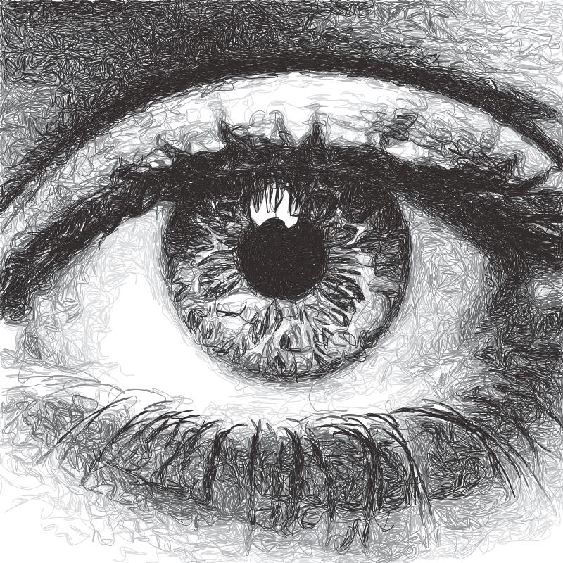

Settings
--------------

Curves
^^^^^^^^^^^^^^^^^^^^^^

.. glossary::

    Curve Tension

        ``Values: Number (Range: 0.01 -> 1.0)``

        Affects the tension of the catmull-rom splines

        - *0.0* = No Tension, unpredictable curves
        - *0.5* = Medium Tension, smooth curves
        - *1.0* = Maximum tension, straight lines.

----

Sketch Squares
======================
Transforms an image into lines in a rectangular pattern using brightness data.

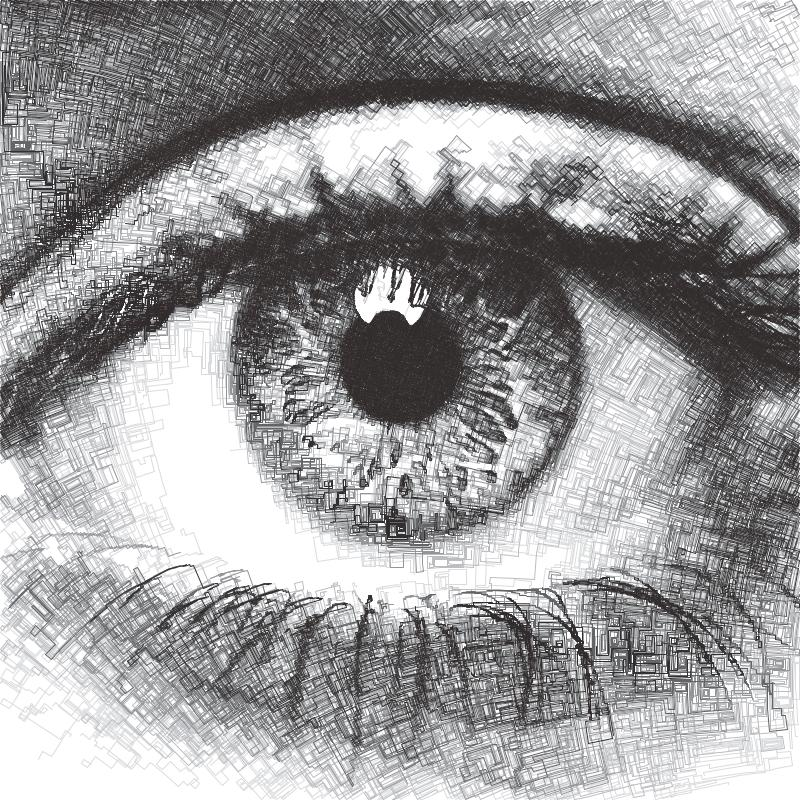

Settings
-------------

Squares
^^^^^^^^^^^^^^^^^^^^^^

.. glossary::

    Start Angle

        ``Values: Number (Range: -360 -> 360)``

        Affects the rotation of the squares, useful to alter the results without dramatically changing the form of the squares.

----

Sketch Quad Beziers
======================
Transforms an image into `Quadratic Bézier curves <https://en.wikipedia.org/wiki/B%C3%A9zier_curve#Quadratic_B%C3%A9zier_curves>`_ using brightness data, by first finding the darkest line and then finding the darkest position for one control point. It uses more accurate "Bresenham" calculations which results in increased precision but longer processing times.

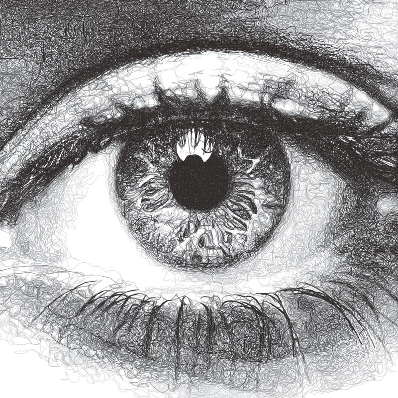

Settings
------------------

Curves (Quad Beziers)
^^^^^^^^^^^^^^^^^^^^^^^^
.. glossary::

    Curve Tests

        ``Values: Number (Range: 1 -> 45)``

        the number of positions to test for each control point to find the darkest curve, increasing this will result in a more accurate plot.

    Curve Variation

        ``Values: Number (Range: 1 -> 1000)``

        the maximum magnitude of the curve. Increasing this will decrease the test accuracy and increase the control point's offsets.

    Curve Offset

        ``Values: Number (Range: -100 -> 100)``

        Allow you to control the ‘wiggle’ of the curve by defining the maximum offset the control's points can move from the initial segment.

        For _`Sketch Quad Beziers`, this is a single control which controls the variation of the central point of each quad segment.

        For _`Sketch Cubic Beziers`, this is an A & B Offset which each control the variation of the A & B control points on the cubic segment.

**+ Inherits settings from:**
    - `Sketch Lines`_

----

Sketch Cubic Beziers
======================
Transforms an image into `Cubic Bézier curves <https://en.wikipedia.org/wiki/B%C3%A9zier_curve#Cubic_B%C3%A9zier_curves>`_ using brightness data, by first finding the darkest line and then finding the darkest position for the two control points. It uses more accurate "Bresenham" calculations which results in increased precision but longer processing times.

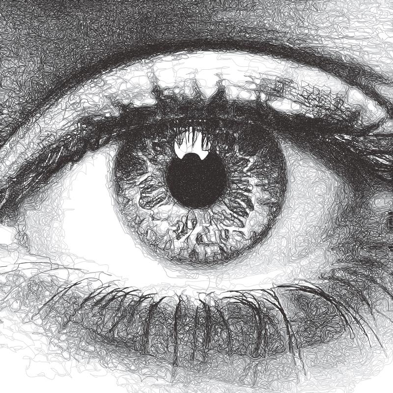

Settings
------------

**+ Inherits settings from:**
    - `Sketch Lines`_
    - `Sketch Quad Beziers`_

----

Sketch Catmull-Roms
======================
Transforms an image into `catmull-rom splines <https://en.wikipedia.org/wiki/Centripetal_Catmull%E2%80%93Rom_spline>`_ using brightness data, by finding the next darkest curve from each point. It uses more accurate "Bresenham" calculations which results in increased precision but longer processing times.

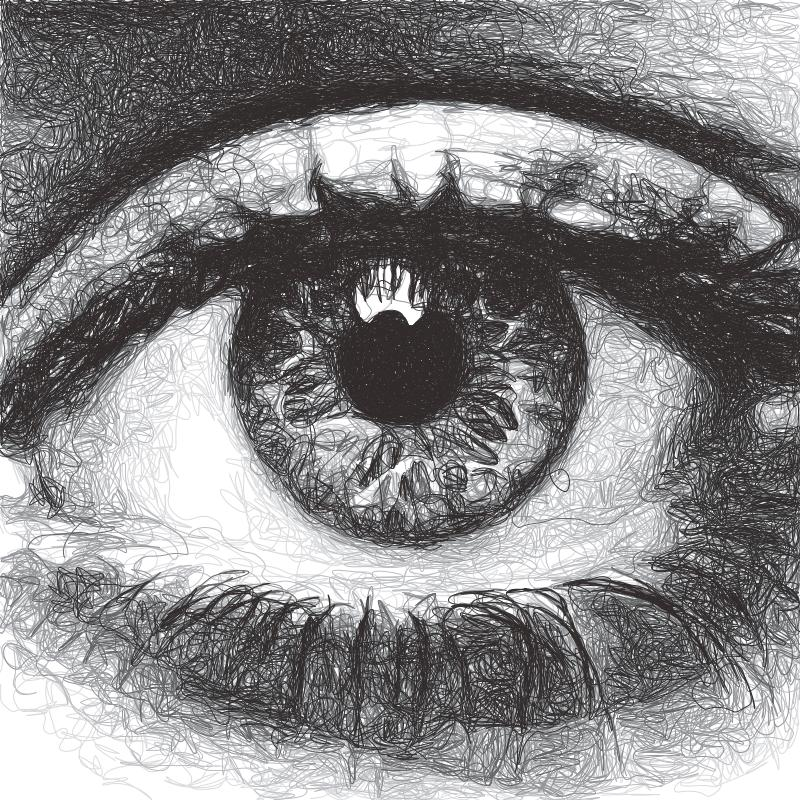

Settings
--------------

**+ Inherits settings from:**
    - `Sketch Lines`_
    - `Sketch Curves`_

----

Sketch Shapes
======================
Transforms an image into shapes using brightness data. It has the following modes: Rectangle and Ellipse.

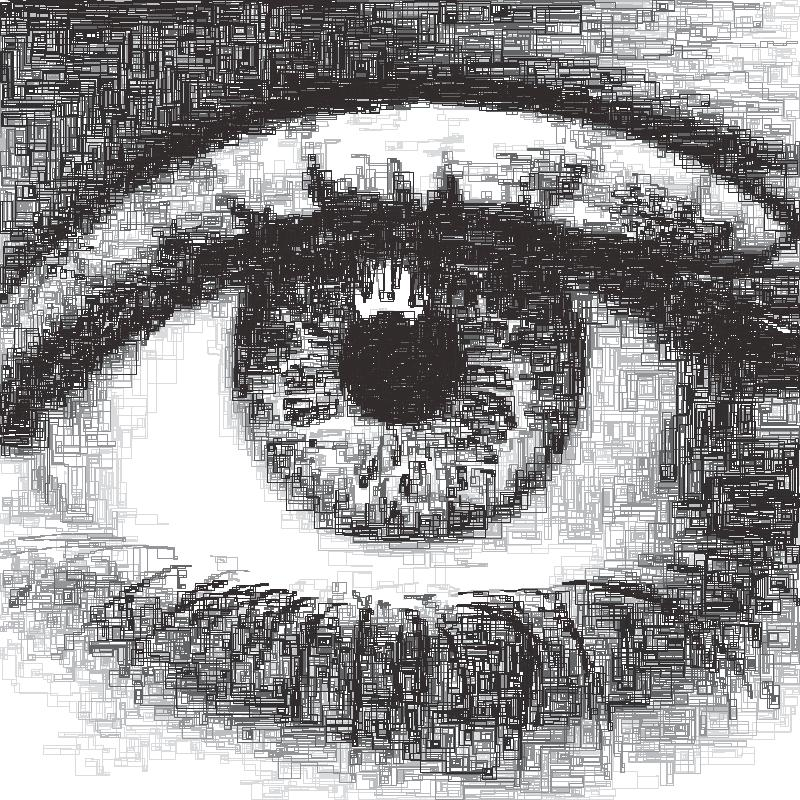

Settings
-----------

Shapes (Sketch Shapes)
^^^^^^^^^^^^^^^^^^^^^^^^^^^^

.. glossary::

    Shape Type (Sketch Shapes)

        ``Values: Rectangles | Ellipses``

        Allows you to choose the type of shapes to create the drawing with.

            - Rectangles: All of the rectangles will be linked by sharing a corner segment, which means this setting is still fast to plot.
            - Ellipses: All ellipses will end in similar positions but won't be linked so will require more pen lifts. May change in the future.

**+ Inherits settings from:**
    - `Sketch Lines`_

----

Sketch Sobel Edges
======================
Transforms an image into lines using brightness & edge detection data. By using a `Sobel Operator <https://en.wikipedia.org/wiki/Sobel_operator>`_ to find edges and then using this data in conjunction with the brightness to find the next line.

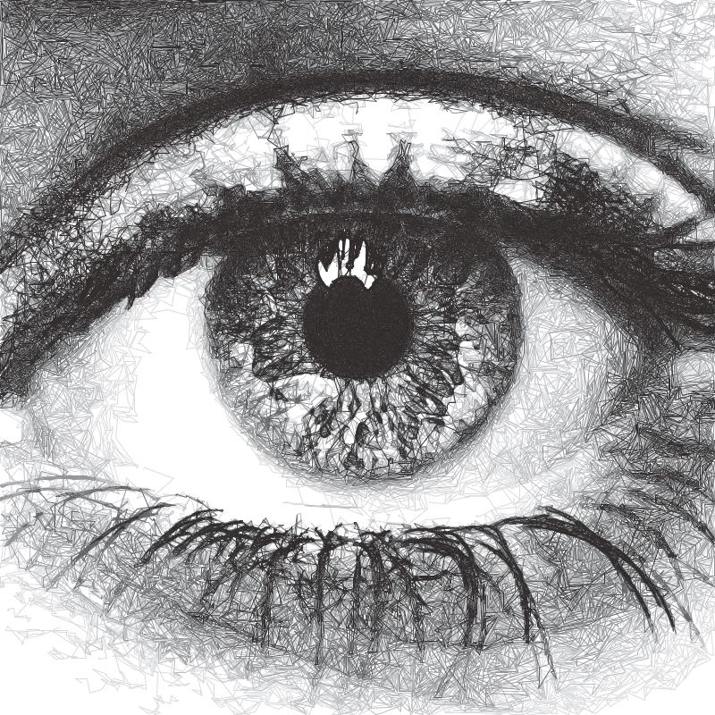

Settings
-----------

Sobel
^^^^^^^^^^^^^^^^^^^^^^

.. glossary::

    Sobel Intensity

        ``Values: Number (Range: 0 -> 10)``

        The priority of edge detection vs brightness

    Sobel Adjust

        ``Values: Number (Range: 0 -> 255)``

        Similar to __`Erasing`, the amount to decrease a pixel's sobel value by when a line is drawn over it, affects how strongly the PFM is affected by the sobel values.

**+ Inherits settings from:**
    - `Sketch Lines`_

----

Sketch Waves
======================
Transforms an image into lines which follow the direction defined by an X and Y curve function.

.. image:: images/pfms/sketch_waves_1.jpg
    :width: 300pt

Settings
---------

Waves
^^^^^^^^^^^^^^^^^^^^^^

.. glossary::

    Start Angle (Sketch Waves)

        ``Values: Number (Range: -360 -> 360)``

        Affects the rotation of the waves, useful to alter the results without dramatically changing the form of the waves.

    Wave Offset X/Y

        ``Values: Number (Range: -1000 -> 100)``

        Shifts the X/Y wave across the image.

    Wave Divisor X/Y

        ``Values: Number (Range: -1000 -> 1000)``

        Affects the intensity of the X/Y wave, increasing the divisor will result in flatter waves, decreasing it will result in more exaggerated waves

    Wave Type X/Y

        ``Values: Sin | Cos | Tan``

        Changes the mathematical function used to create the wave.

**+ Inherits settings from:**
    - `Sketch Lines`_

----

Sketch Flow Field
======================
Transforms an image into lines which follow the direction defined by a "Flow Field"

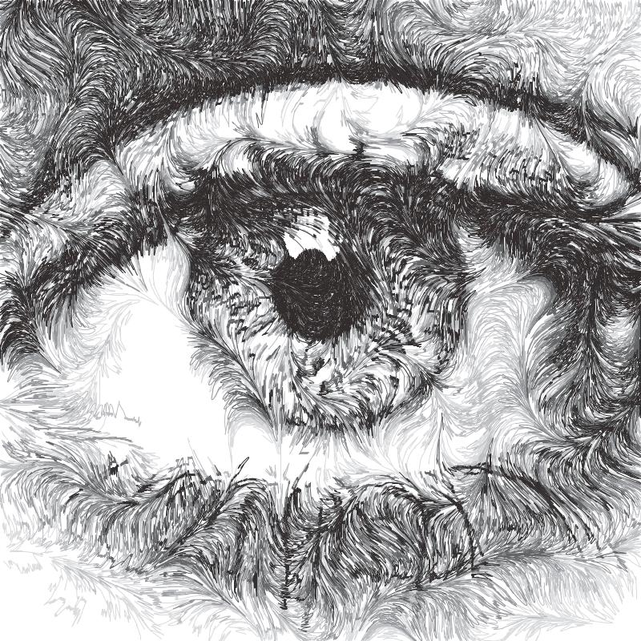

Settings
---------

Default Flow Field Settings
^^^^^^^^^^^^^^^^^^^^^^^^^^^^^^^^^^^^^^

.. glossary::

    Start Angle (Flow Field)

        ``Values: Number (Range: -360 -> 360)``

        Controls the initial angle of the Flow Field, rotating the resulting field

    X Frequency (Flow Field)

        ``Values: Number (Range: 0.001 -> 4)``

        Controls the rate of change on the X Axis of the flow field, higher frequency = more detailed flow field

    Y Frequency (Flow Field)

        ``Values: Number (Range: 0.001 -> 4)``

        Controls the rate of change on the Y Axis of the flow field, higher frequency = more detailed flow field

    Scale Frequency (Flow Field)

        ``Values: Number (Range: 0.01 -> 20)``

        Allows you to scale the :term:`X Frequency (Flow Field)` and :term:`Y Frequency (Flow Field)` uniformly, a quick way to alter the detail of the resulting flow field

    Amplitude (Flow Field)

        ``Values: Number (Range: 0.0 -> 1.0)``

        Controls the amplitude / influence of the resulting flow field, a low amplitude will converge the flow fields closer to the :term:`Start Angle (Flow Field)`

**+ Inherits settings from:**
    - `Sketch Lines`_

----

Sketch Superformula
======================
Transforms an image into lines which follow a `Superformula <https://en.wikipedia.org/wiki/Superformula>`_

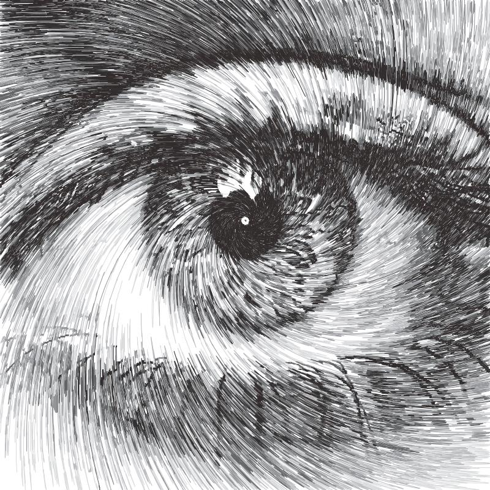

Settings
---------

Default Superformula Settings
^^^^^^^^^^^^^^^^^^^^^^^^^^^^^^^^^^^^^

.. glossary::

    Start Angle (Superformula)

        ``Values: Number (Range: -360 -> 360)``

        Controls the rotation of the shape/field generated by the Superformula

    Centre X/Y (Superformula)

        ``Values: Number (Range: 0.0 -> 100.0)``

        Controls the origin point of the superformula, expressed as a percentage of the images width/height, allowing you to easily move the generated patterns across the image.

    X/Y Scale (Superformula)

        ``Values: Number (Range: 1 -> 20)``

        Allows you to scale the shape/field generated by the Superforumla, essentially zooming into the generated pattern.

    Frequency (Superformula)

        ``Values: Number (Range: 0.0 -> 20.0)``

        Controls the variation of the Superformula pattern around the centre point, equivalent to the **m** parameter in the superformula equation.

    Curvature (Superformula)

        ``Values: Number (Range: 0.0 -> 80.0)``

        Controls the smoothing between the frequencies generated around the centre point, equivalent to the **n1** parameter in the superforumla equation.

    Sine/Cos Factor (Superformula)

        ``Values: Number (Range: 0.0 -> 80.0)``

        Controls variation in the X/Y axis, equivalent to the **n2** & **n2** parameters in the superforumla equation.

**+ Inherits settings from:**
    - `Sketch Lines`_

----

Sketch Sweeping Curves
======================

This PFM is focused on creating long sweeping curves which are more natural / human-like, focused on creating longer curves.
Unlike other Curve PFMs which sometimes turn sharply, Sweeping curves will gently change direction.
This makes this PFM really excellent for figures, portraits and curved objects.

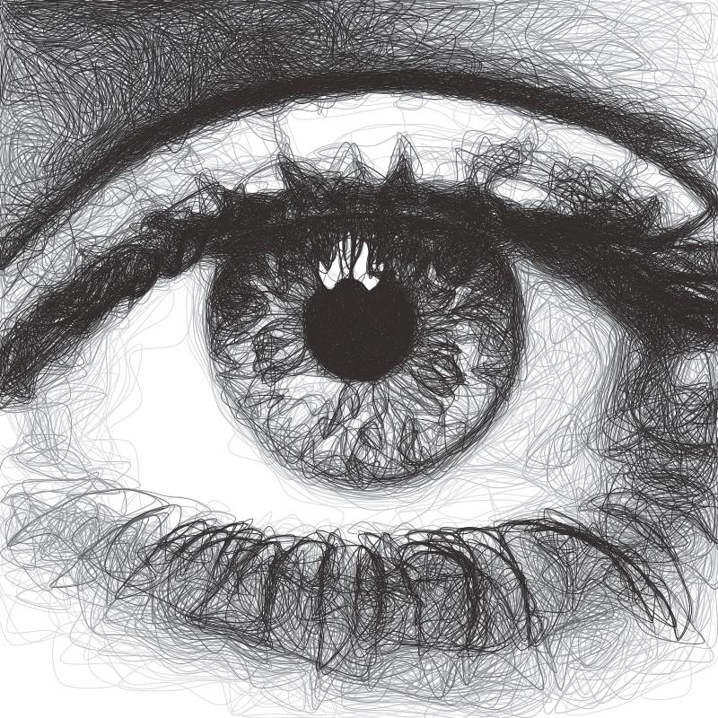

Settings
----------

Curves (Sweeping Curves)
^^^^^^^^^^^^^^^^^^^^^^^^^^^^^^^^^^^^^^^^^^

.. glossary::

    Curvature

        ``Values: Number (Range: 0 -> 1.0)``

        Controls the appearance of "knots" in the curve, it will make a greater visual difference at extreme changes in direction which _`Sketch Sweeping Curves` tries to avoid so the difference will be subtle.

        - 0 = Uniform Catmull-Rom
        - 0.5 = Centripetal Catmull-Rom (Default)
        - 1.0 Chordal Catmull-Rom

**+ Inherits settings from:**
    - `Sketch Lines`_

***********************
Streamline PFMs
***********************

Streamline PFMs generate streamlines to represent an image which are driven by the direction from a vector field. The streamlines are spaced according to the brightness of the image without overlapping. The underlying vector field can be altered dramatically to create many different styles which still remaining faithful to the original images brightness. This makes them very versatile for creating stylised wave like patterns which can be highly customised.

They are also suitable for single or multi-pen plots, and CMYK or Colour Match plots.

By default Streamline PFMs use the "Luminance Weighted" pen distribution creating multi-pen plots which distribute the streamlines based on their luminance.

Default Streamline Settings
============================================

Streamlines
---------------------------------------

.. glossary::

 Min Spacing

    ``Values: Number (Safe Range: 0.5 -> 20.0)``

    Controls the minimum spacing between the generated streamlines, see :term:`Tone (Streamlines PFMs)`

 Max Spacing

    ``Values: Number (Safe Range: 2.0 -> 50.0)``

    Controls the maximum spacing between the generated streamlines, see :term:`Tone (Streamlines PFMs)`

 Min Length

    ``Values: Number (Safe Range: 0 -> 20.0)``

    Controls the minimum length of the generated streamlines

 Max Length

    ``Values: Number (Safe Range: 0 -> 500.0)``

    Controls the maximum length of the generated streamlines

 Tone (Streamlines PFMs)

    ``Values: Number (Safe Range: 0 -> 100.0)``

    Controls the contrast of the generated streamlines, by controlling a tone curve between the :term:`Min Spacing` / :term:`Max Spacing`.

 Distortion (Streamlines PFMs)

    ``Values: Number (Safe Range: 0 -> 100.0)``

    Controls the random distortion of the generated streamlines, allowing more hand-drawn like streamlines to be generated

----

Streamlines Edge Field
======================================
Generates streamlines based on the natural direction of an image as described by an "Edge Tangent Flow" vector field and an optional "Flow Field" vector field.

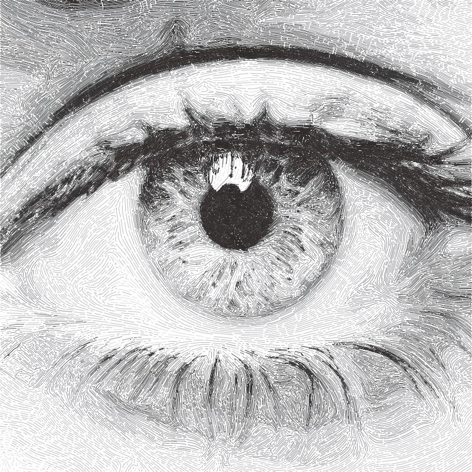

Settings
---------------------------------------

**+ Inherits settings from:**
    - `Default Streamline Settings`_
    - `Default Flow Field Settings`_

Edge Tangent Flow
^^^^^^^^^^^^^^^^^^^^^^

.. glossary::

 Edge Power (Streamlines Edge Field)

    ``Values: Number (Safe Range: 0.0 -> 100.0)``

    Controls the influence of the Edge Tangent Flow and instead favour the underlying Flow Field. A value of 100 will ignore the flow field, a value of 50 will be influenced equally by the "Edge Field" and the "Flow Field"

 ETF Iterations

    ``Values: Number (Safe Range: 0.0 -> 100.0)``

    Controls the number of refinement operations to perform on the Edge Tangent Flow. The refinement steps are required in order to allow the ETF to converge towards the best edge directions, many iterations will result in a very smooth Edge Field creating long sweeping streamlines which may lose small details, too few iterations may result in artifacts and shorter streamlines

 ETF Radius

    ``Values: Number (Safe Range: 3.0 -> 30.0)``

    Controls the size of the kernel to be used when refining the ETF and therefore the number of pixels to compare (ETF Radius of 9 -> 9x9 = 81 pixels), a lower radius will compute faster but may contain more artifacts caused by noise in the original image, a larger radius will take longer to process and may lose small details.

 Post Blur Iterations

    ``Values: Number (Safe Range: 0.0 -> 50.0)``

    Controls the number of post blur operations to perform on the Edge Tangent Flow after refinement. Adding post blur will remove detail from the Edge Field but create aesthetically pleasing results.

    **Quick Tip:** Try out the "Fingerprints" preset which uses Post Blur iterations to create it's effect.

 Post Blur Radius

    ``Values: Number (Safe Range: 0.0 -> 50.0)``

    Controls the size of the kernel used in the post blur operation

----

Streamlines Flow Field
======================================
Generates streamlines based on a "Flow Field" vector field.

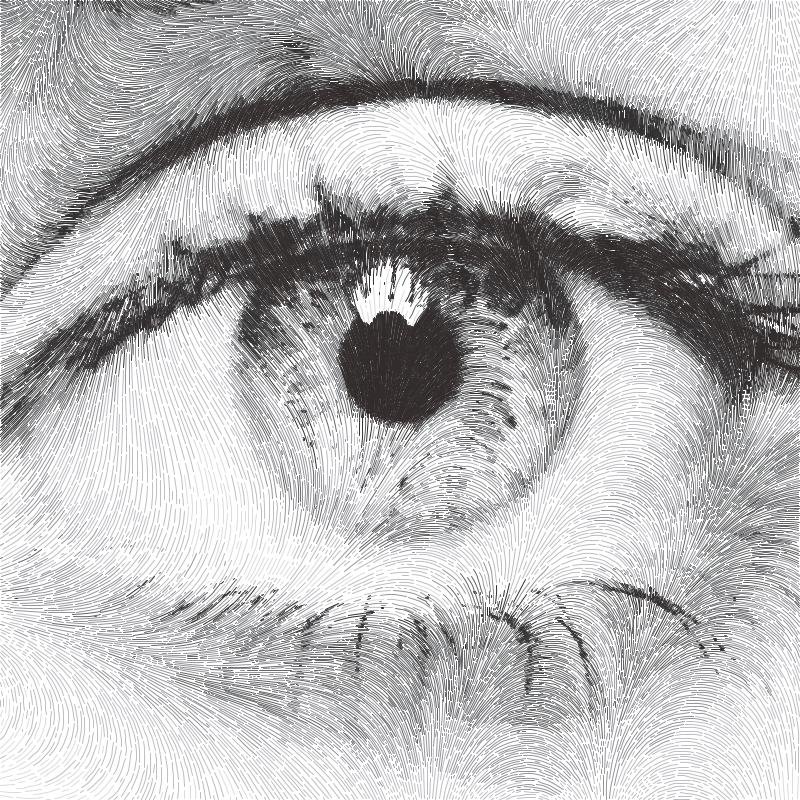

Settings
---------------------------------------

**+ Inherits settings from:**
    - `Default Streamline Settings`_
    - `Default Flow Field Settings`_

----

Streamlines Superformula
======================================
Generates streamlines based on a `Superformula <https://en.wikipedia.org/wiki/Superformula>`_ vector field.

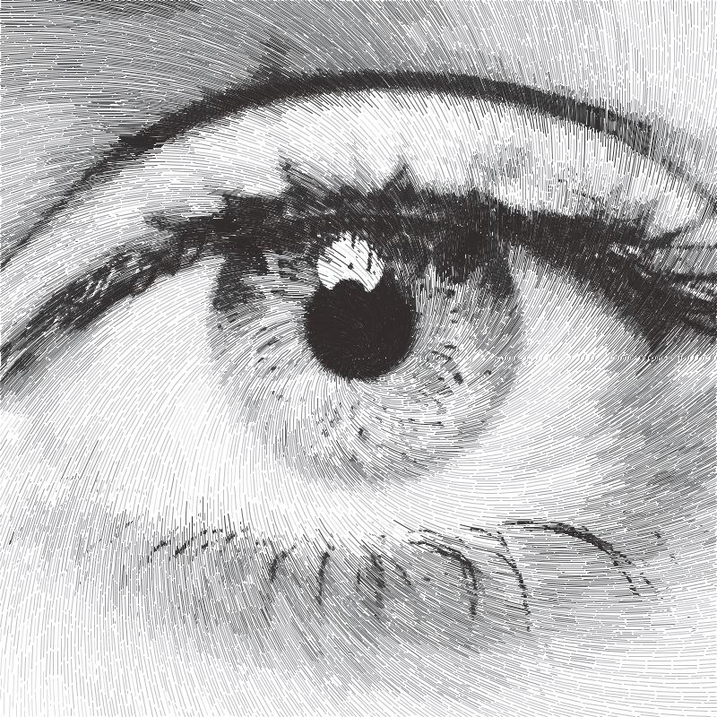

Settings
---------------------------------------

**+ Inherits settings from:**
    - `Default Streamline Settings`_
    - `Default Superformula Settings`_

----

***********************
Spiral PFMS
***********************

Spiral PFMs are suitable for plots with a single pen, and can generate spirals which are continuous without any pen lifts.

With a small Ring Spacing they can also be very accurate and represent small details in the original image.

How they work
======================
1) Moves to the first point on the spiral.
2) Samples the brightness at the current point and draws a line which is perpendicular to the spiral where the line's length is proportional to the sampled brightness.
3) Move to the next point on the spiral and Repeat step 2.

The process stops when the specified :term:`Spiral Size` has been reached

Default Spiral Settings
--------------------------

Spiral
^^^^^^^^^^^^^^^^^^^^^^

.. glossary::

 Spiral Type
    ``Values: Archimedean | Parabolic``

    Changes the style of the generated Spiral

    - **Archimedean:** a single spiral
    - **Parabolic:** two connected spirals, this can be used for creating a spiral out of two different pens. Change your Distribution Type to "Preconfigured" after processing has finished.

 Spiral Size

    ``Values: Number (Safe Range: 0 -> 100)``

    Alters where the generated spiral will end. A spiral at 100% will always reach the corner of the image.

    **Quick Tip:** You can adjust the Spiral Size after the drawing has been generated with the Shapes Slider.

 Centre X/Y

    ``Values: Number (Safe Range: 0 -> 100)``

    Controls the centre position the spiral starts from as percentages relative to the images width/height.

    e.g. Left = 0, Middle = 50, Right = 100

 Ring Spacing

    ``Values: Number (Safe Range: 0 -> 50)``

    The distance between each generated ring, which also has the effect of increasing the width of the rings as the :term:`Amplitude (Spiral PFMs)` is proportional to the Ring Spacing.

    A lower Ring Spacing will resolve more detail from the original image.

 Amplitude (Spiral PFMs)

    ``Values: Number (Safe Range: 0.01 -> 2.0)``

    Controls the scaling of the lines/shapes generated along the spiral. It is proportional to the **Ring Spacing**

    :math:`finalWidth = ringSpacing * (amplitude)`

 Variable Velocity

    ``Values: Boolean (True | False)``

    When **True**, the velocity will vary between the Min & Max proportionally to the image's luminance.

    When **False**, the Min Velocity will always be used.

 Min/Max Velocity (Spiral PFMs)

    ``Values: Number (Safe Range: 1.0 -> 360.0)``

    Controls the frequency of shapes along the spiral. Lower velocities will result in more shapes, higher will result in less.

    The velocity variables should be used to adjust the overall contrast of the spiral (adding a contrast filter in Image Processing is a good place to start too).

    - Higher velocity = less shapes generated, lower plotting time. High values will result in more inconsistent results as the spiral generation may skip of key areas of the image.
    - Lower velocity = more shapes generated, higher plotting time. More accurate to the original image.

    :math:`velocity = minVelocity + sineFunction(luminance) * (maxVelocity-minVelocity)`

 Ignore White (Spiral PFMs)

    ``Values: Boolean (True | False)``

    When **True**, if the spiral reaches a white pixel in the source image the spiral will not be drawn.

    When **False**, the spiral will draw over the entire image up to the Spiral Size.

----

Spiral Sawtooth
======================
Transforms an image into a oscillating spiral.

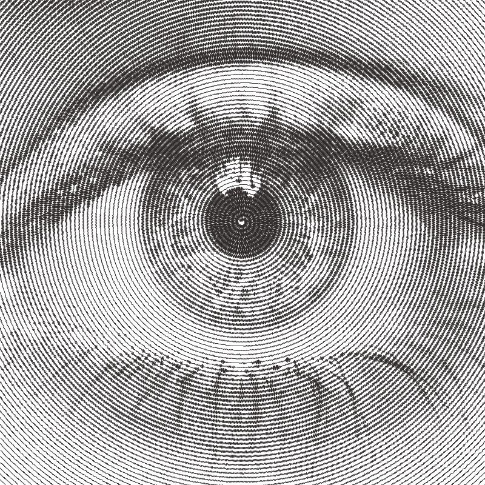

Settings
--------------------

Spiral
^^^^^^^^^^^^^^^^^^^^^^

.. glossary::

 Connected Lines (Spiral Sawtooth)

    ``Values: Boolean (True | False)``

    When **True**, the generated lines will be connected and if the spiral finishes within the boundaries of the paper the final drawing will have no pen lifts.

    When **False**, every generated line along the spiral will be disconnected.

----

Spiral Circular Scribbles
======================================
Transforms an image into a oscillating spiral.

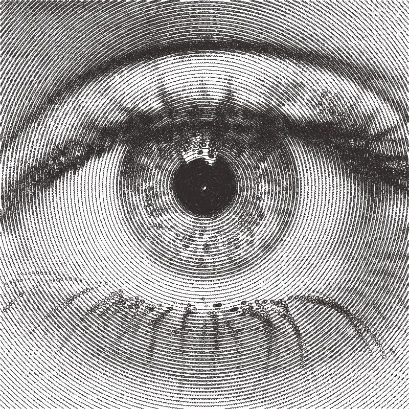

Settings
---------------------------------------

**+ Inherits settings from:**
    - `Default Spiral Settings`_
    - `Adaptive Circular Scribbles`_ (some settings are hidden)

***********************
Hatch PFMs
***********************

Hatch PFMs generate a set of lines across the image and then use different styles to turn these lines into waves/scribbles whose width matches the luminance at a given point.

They are suitable for plots with a Single Pen and similarly to Spiral PFMs can generate continuous hatched lines across the drawing which don't require any pen lifts.

Default Hatch Settings
=============================

Hatching
---------------

.. glossary::

 Line Spacing

    ``Values: Number (Safe Range: 2.0 -> 50.0)``

    Controls the spacing of the generated lines.

 Angle

    ``Values: Number (Safe Range: 2.0 -> 50.0)``

    Controls the angle of the generated lines.

 Crosshatch

    ``Values: Boolean (True | False)``

    When **True**, an additional set of lines will be generated travelling perpendicular to the current angle, creating a crosshatched effect.

 Link Ends

    ``Values: Boolean (True | False)``

    When **True**, the ends of the generated lines will be linked, creating a plot which doesn't require any pen lifts.

----

Hatch Sawtooth
======================

Uses an oscillating wave of varying velocity to create a set of lines

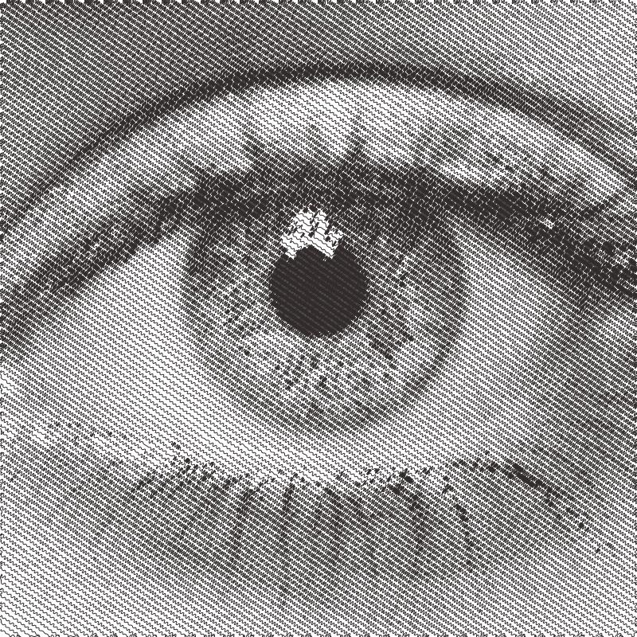

Settings
--------------------

Sawtooth
^^^^^^^^^^^^^^^^^^^^^^

.. glossary::

 Amplitude (Hatch Sawtooth)

    ``Values: Number (Safe Range: 0.01 -> 2.0)``

    Controls the scaling of the shapes generated along the lines. It is proportional to the **Line Spacing**.

    :math:`finalWidth = lingSpacing * (amplitude)`

 Min/Max Velocity (Hatch Sawtooth)

    ``Values: Number (Safe Range: 1.0 -> 360.0)``

    Controls the frequency of shapes along the generated lines. Lower velocities will result in more shapes, higher will result in less.

    Similar to Min/Max Velocity in Spiral PFMs

    :math:`velocity = minVelocity + sineFunction(luminance) * (maxVelocity-minVelocity)`

 Curve Tension (Hatch Sawtooth)

    ``Values: Number (Safe Range: 0.0 -> 1.0)``

    See `Sketch Curves`_

**+ Inherits settings from:**
    - `Default Hatch Settings`_

----

Hatch Circular Scribbles
======================================

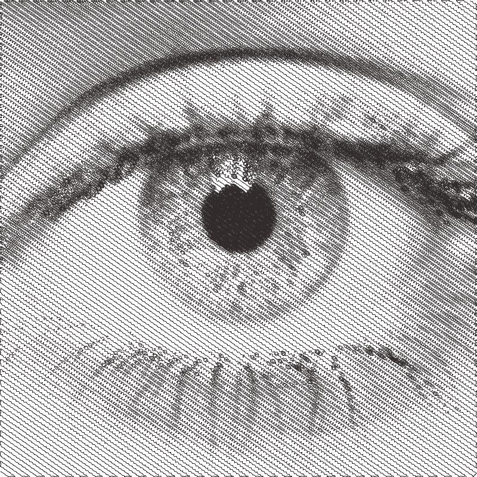

Settings
--------------------

**+ Inherits settings from:**
    - `Default Hatch Settings`_
    - `Adaptive Circular Scribbles`_

***********************
Adaptive PFMS
***********************

'Adaptive' are named after the way they adapt to match the tone of the input image.

The reproduction of tones is considerably more accurate than other PFMs as they have an additional "Tone Mapping" processing stage. This process only needs to be performed once per configuration of settings. If you change a setting which could alter the tone map it will be generated again.

You can view the output of the tone mapping stage by selecting "Display:" and then "Tone Map". This shows you three outputs; the Reference Tone Map, the drawing created by the PFM with the current settings and the blurred version of this output.

Adaptive PFMs are suitable for Single Pen Plots or Multi Colour Plots

**For the best results with Adaptive PFMs use high resolution, high contrast images**

How do they work?
======================================
1) Generate a Tone Map using steps 2 to 3, analyse the result then create a new input image which will result in drawing with a more accurate representation of the original tones.
2) Create evenly distributed points across the image based on brightness.
3) Generate the specific style based on these points.

Default Adaptive PFM Settings
======================================

Adaptive Sampling
---------------------

.. glossary::

 Min/Max Sample Radius (Adaptive PFMs)

    ``Values: Number (Safe Range: 0.1 -> 100.0)``

    Controls the distribution of the generated points, controlling the contrast and detail present in the final image.

    In general keeping Min Sample Radius < 2 and changing the Max Sample Radius will provide the best results with more Adaptive PFMs.

    Unlike LBG & Voronoi, Adaptive PFMs follow the sample sizes strictly and place points evenly across the entire image and produce a consistent looking drawing.

 Brightness (Adaptive PFMs)

    ``Values: Number (Safe Range: 0.0 -> 2.0)``

    Controls the brightness applied as a pre-processing step to the source image, see :term:`Contrast (Adaptive PFMs)`.

 Contrast (Adaptive PFMs)

    ``Values: Number (Safe Range: 0.0 -> 2.0)``

    Controls the contrast applied as a pre-processing step to the source image.

    The quality of Drawings from Adaptive PFMs rely massively on contrast and brightness so these controls are included for simplicity, though they behave the same as adding a contrast filter in the Pre-Processing tab.

 Ignore White (Adaptive PFMs)

    ``Values: Boolean (True | False)``

    When **True**, points will not be placed in the white areas of the image.

----

Adaptive Circular Scribbles
======================================
Transforms an image into a single continuous circular scribble.

This is an implementation of Chiu Et Al 2015, “Tone‐ and Feature‐Aware Circular Scribble Art”. If you wish to achieve results similar to Chiu Et Al’s implementation use a size of paper, pen width which gives you a plotting size of 4000px on the largest edge then use the “Chiu Et Al – 4000px” preset

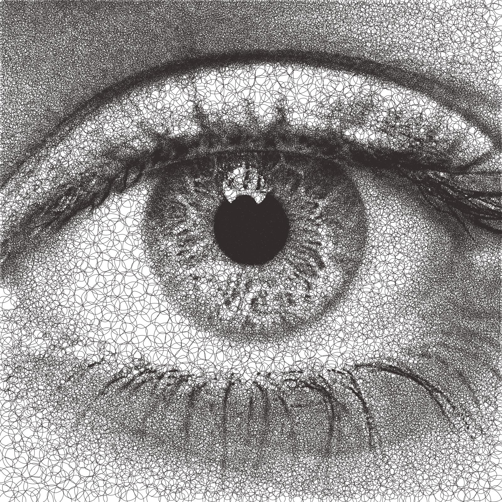

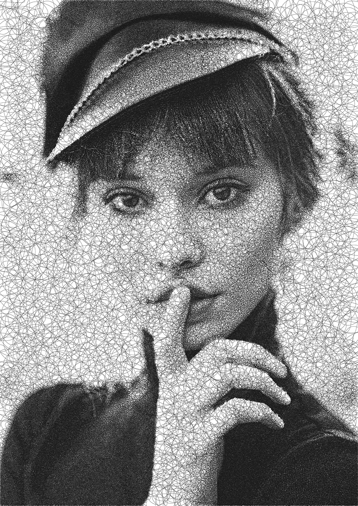

Settings
--------------------

Circular Scribbles
^^^^^^^^^^^^^^^^^^^^^^

These settings are shared by  _`Spiral Circular Scribbles`, _`Adaptive Circular Scribbles` and _`LBG Circular Scribbles`

.. glossary::

 Min/Max Radius (Circular Scribbles)

    ``Values: Number (Safe Range: 0.1 -> 128)``

    Controls the radius of the generated Circular Loops which make up the scribble. The radius will vary across the drawing based on the image's *luminance*.

    :math:`radius = minRadius + (luminance * (maxRadius-minRadius))`

    .. image:: images/circularscribbles/circular_scribbles_radius_increase.png

    *e.g - Circular Scribble varying from Min Radius to Max Radius*

 Min/Max Velocity (Circular Scribbles)

    ``Values: Number (Safe Range: 0.1 -> 128)``

    Controls the min/max velocity of the generated Circular Scribbles, in other words this controls the frequency of circular loops in the final scribble.
    The radius will vary across the drawing based on the image's *luminance*.

    :math:`velocity = minVelocity + (luminance * (maxVelocity-minVelocity))`

    .. image:: images/circularscribbles/circular_scribbles_velocity_increase.png

    *e.g - Circular Scribble varying from Min Velocity to Max Velocity*

 Angular Velocity

    ``Values: Number (Safe Range: 0.1 -> 180)``

    Controls the speed of rotation of the scribbles. Low angular velocity will result in fewer loops, higher velocity will result in more loops.
    Generally the angular velocity should be at least double the maximum velocity if you wish the scribbles to always create loops.
    The default is generally good, but it can be useful to adjust it slightly for some images.

    .. image:: images/circularscribbles/circular_scribbles_angular_velocity_10.png

    *e.g. Angular Velocity = 10*

    .. image:: images/circularscribbles/circular_scribbles_angular_velocity_40.png

    *e.g. Angular Velocity = 40*

 Azimuth Angle Min/Max

    ``Values: Number (Range: -180 -> 180)``

    Controls the pitch of the circular scribbles, resulting in a slanting effect.
    Note: If you wish to introduce a regular slant keep the min/max the same.

    .. image:: images/circularscribbles/circular_scribbles_azimuth_45.png

    *e.g. Azimuth Angle Min = 45 & Azimuth Angle Max = 45*

 Polar Angle Min/Max

    ``Values: Number (Range: -180 -> 180)``

    Controls the yaw of the circular scribbles, resulting in closing/widening the circular loops
    Note: Similarly to Polar Angle, keeping the values the same will result in a consistent style.

    .. image:: images/circularscribbles/circular_scribbles_polar_45.png

    *e.g. Polar Angle Min = 45 & Polar Angle Max = 45*

 Curvature (Circular Scribbles)

    ``Values: Number (Range: 0 -> 1)``

    Controls the interpolation between scribble points, 0 = Straight Lines -> 1 = Smooth Curves

    .. image:: images/circularscribbles/circular_scribbles_curvature_0.png

    *e.g. Curvature = 0*

    .. image:: images/circularscribbles/circular_scribbles_curvature_1.png

    *e.g. Curvature = 1*

 Edge Retention

    ``Values: Boolean (True | False)``

    When **True**, the radius of Circular Scribbles will be adapted to prevent them from overlapping the detected edges in the image, resulting in more detail being retained in the final drawing.

    Set the Edge Threshold A & B, to alter the number of edges detected.

    .. image:: images/circularscribbles/circular_scribbles_edge_retention_comparison.jpg

    *Comparison: Fig 1. Original Image, Fig 2. Default Settings, Fig 3. Default Settings w/ Edge Retention=True*

 Edge Threshold A & B

    ``Values: Number (Range: 1F -> 255F)``

    These thresholds are used by the internal Canny Edge Detector to filter out the target edges. Raising the threshold will reduce the effect of the edge retention.

    From the `OpenCV documentation <https://docs.opencv.org/3.4/da/d22/tutorial_py_canny.html>`_

        a) If a pixel gradient is higher than the upper threshold, the pixel is accepted as an edge
        b) If a pixel gradient value is below the lower threshold, then it is rejected.
        c) If the pixel gradient is between the two thresholds, then it will be accepted only if it is connected to a pixel that is above the upper threshold.

    Canny recommended an upper:lower ratio between 2:1 and 3:1.

----

Adaptive Shapes
======================================
Transforms an image into a series of packed shapes

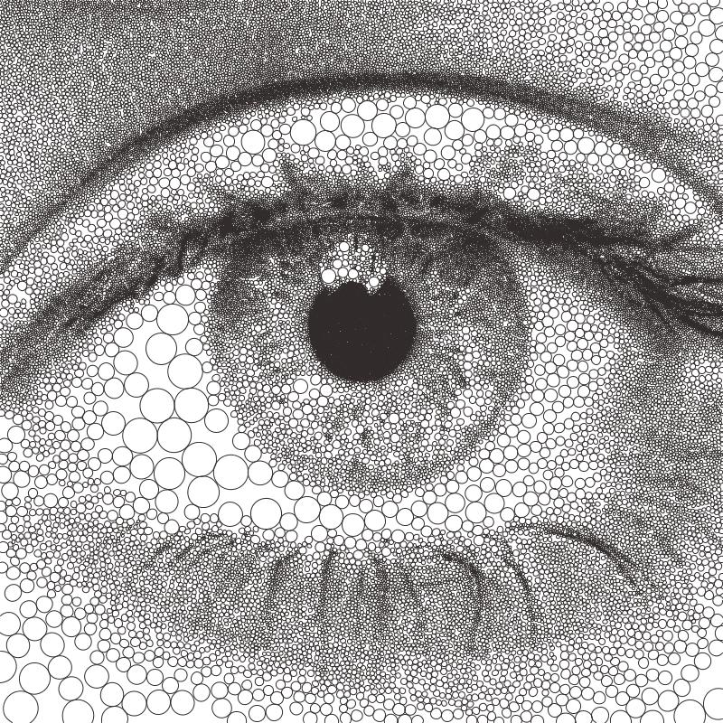

Settings
----------

Shapes
^^^^^^^^^^^^^^^^^^^^^^

.. glossary::

 Shape Type (Adaptive Shapes)

    ``Values: Circle | Square | Star | Triangle | Cross | Multiply | LP Space | Random``

    Controls the shape type generated at each sample point, most are self-explanatory with the exception of LP Space which uses

    - **Circle:** generates circles
    - **Square:** generates squares
    - **Star:** generates 5 pointed stars
    - **Triangle:** generates triangles
    - **Cross:** generates a thick cross
    - **Multiply:** generates the outline of a multiply symbol
    - **LP Space:** roughly imitates the LP Space/p-norm function to create shapes which vary from *Diamond -> Circle -> Rounded Square*. This shape type can better represent the tonality of the original image by adjusting its shape to match. It also produces more variety in the final drawing.
    - **Random:** chooses randomly from the other shape types each time a shape is generated, the resulting shapes can be altered by changing the :term:`Random Seed`

    .. image:: images/shapes/shapes_comparison.jpg

    *Fig 1. Circle (Default), Fig 2. Square, Fig 3. Random*

 Align Rotation (Adaptive Shapes)

    ``Values: Boolean (True | False)``

    When **True**, the rotation of the shapes will follow the natural direction of the image, the Min/Max Rotation will be ignored.

    When **False**, the rotation of the shapes will be a random angle between the Min/Max Rotation.

 Min/Max Rotation (Adaptive Shapes)

    ``Values: Number (Safe Range: 0 -> 360)``

    Controls the min/max rotation of the generated shapes.

    Used when *Align Rotation* is set to **False**.

    .. image:: images/shapes/shapes_rotation_comparison.jpg

    *Fig 1. Min & Max Rotation = 0, Fig 2. Min & Max Rotation = 45, Fig 3. Align Rotation = True (Default)*

 Fill Size (Adaptive Shapes)

    Controls the scaling of the shape within the shape available (as defined by the Sampling used e.g. Adaptive, LBG or Voronoi).

    :math:`finalRadius = sampleRadius * (fillSize/100)`

    .. image:: images/shapes/shapes_fillsize_comparison.jpg

    *Fig 1. Fill Size = 50, Fig 2. Fill Size = 100 (Default), Fig 3. Fill Size = 200*

**+ Inherits settings from:**
    - `Default Adaptive PFM Settings`_

----

Adaptive Triangulation
======================================
Transforms an image into a series of connected triangles joining all the points generated using `Delaunay Triangulation <https://en.wikipedia.org/wiki/Delaunay_triangulation>`_

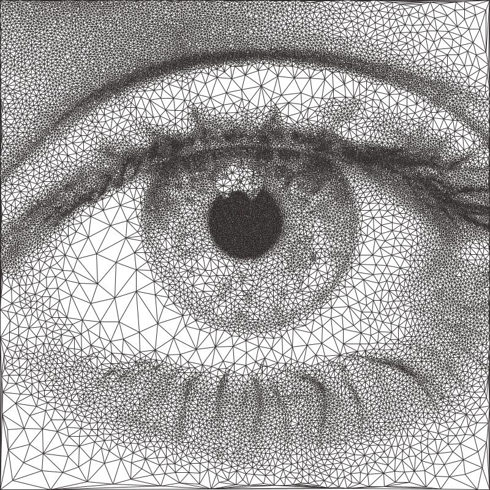

Settings
-----------------

These settings are also shared with `Adaptive Triangulation`_, `LBG Triangulation`_ and `Mosaic Triangulation`_

Transforms an image into a series of connected triangles joining all the sample points generated using `Delaunay Triangulation <https://en.wikipedia.org/wiki/Delaunay_triangulation>`_.

Triangulation
^^^^^^^^^^^^^^^^^^^^^^

.. glossary::

 Triangulate Corners

    ``Values: Boolean (True | False)``

    When **True**, additional sample points will be added at the corners of the drawing, creating a frame out of triangles around the border of the drawing.

    .. image:: images/triangulation/triangulate_corners_comparison.jpg

    *Fig 1. Triangulate Corners = False (Default), Fig 2. Triangulate Corners = True*

**+ Inherits settings from:**
    - `Default Adaptive PFM Settings`_

----

Adaptive Tree
======================================
Transforms an image into a Minimum Spanning Tree, which connects all the points by creating links between each point and its nearest neighbour.

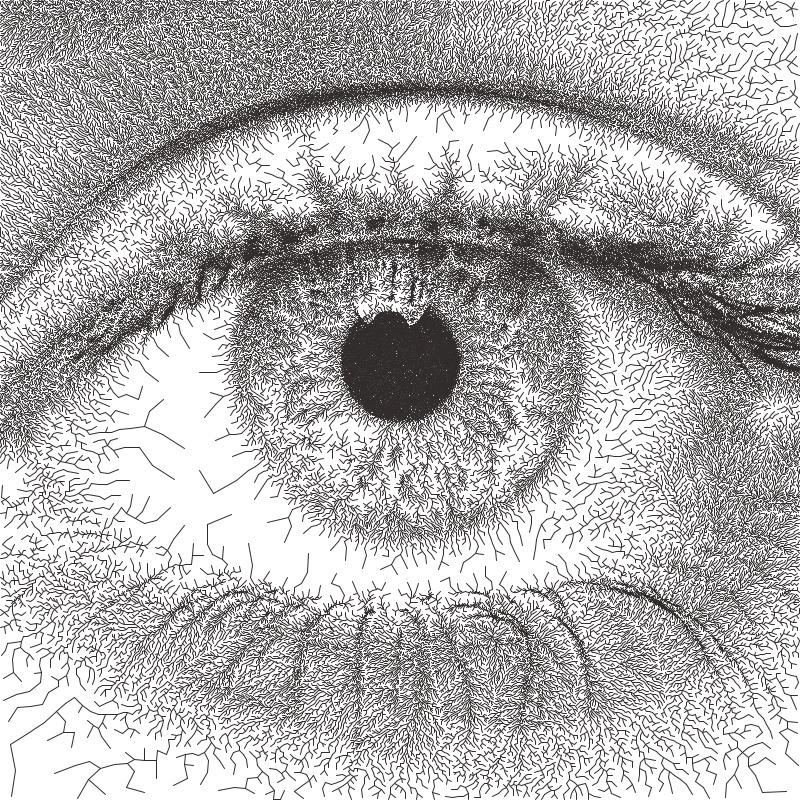

Settings
-----------------

Tree
^^^^^^^^^^^^^^^^^^^^^^

.. glossary::

 Create Curves

    ``Values: Boolean (True | False)``

    When **True**, the lines generated by the PFM will be converted to curves in a final finishing step.

**+ Inherits settings from:**
    - `Default Adaptive PFM Settings`_

----

Adaptive Stippling
======================================
Transforms an image into a series of dots placed at each point generated.

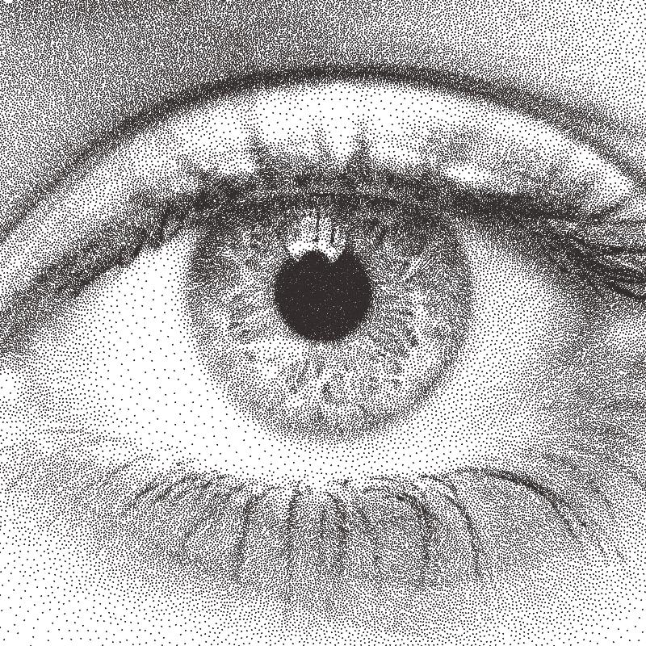

Settings
-----------------

Stippling
^^^^^^^^^^^^^^^^^^^^^^

.. glossary::

 Stipple Size

    ``Values: Number (Safe Range: 1.0 -> 100.0)``

    Controls the size of generated stipples.

**+ Inherits settings from:**
    - `Default Adaptive PFM Settings`_

----

Adaptive Dashes
======================================
Transforms an image into a series of dashes placed at each point generated.

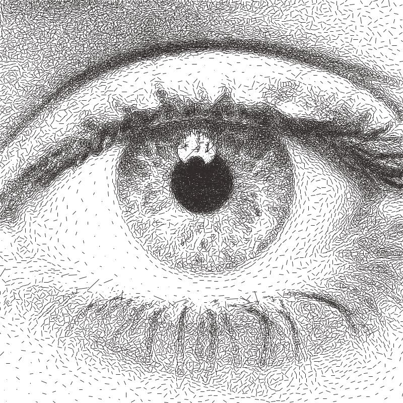

Settings
-----------------

Dashes
^^^^^^^^^^^^^^^^^^^^^^

.. glossary::

 Distortion (Adaptive Dashes)

    ``Values: Number (Safe Range: 0.0 -> 100.0)``

    Controls the random distortion applied to the generated dashes, giving them a more human-like quality.

**+ Inherits settings from:**
    - `Default Adaptive PFM Settings`_
    - `Adaptive Shapes`_

----

Adaptive Letters
======================================
Transforms an image into a series of letters placed at each point generated.

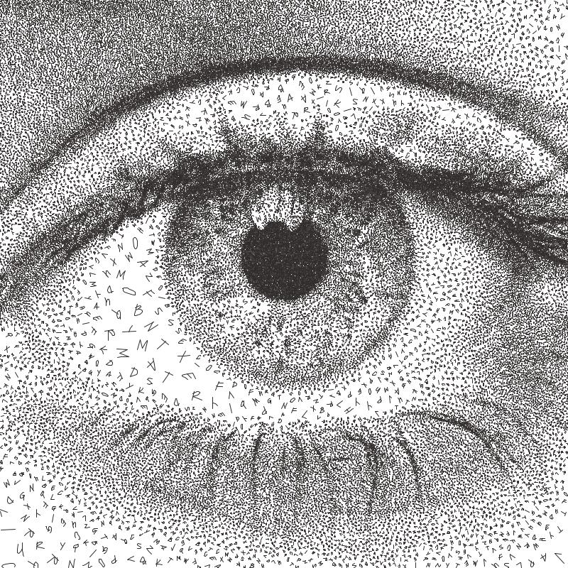

Settings
-----------------

Letters
^^^^^^^^^^^^^^^^^^^^^^

.. glossary::

 Order (Letters)

    ``Values: Tone Mapped | Random | Sequenced``

    Controls how characters are selected for each sample point.

    Letters will only be considered if they pass the :term:`Character Filter` and :term:`RegEx Filter`

    - **Tone Mapped**
        Before processing, the font's characters will be ordered from Darkest -> Brightest.
        Then when selecting letters, the closest match to the image's luminance at the sample point will be selected.

    - **Random**
        A random character will be selected at each position from the chosen :term:`SVG Font`

    - **Ordered**
        Will follow the order of the allowed characters. If a Character Filter has been added then that order will be followed, allowing you to write sentences.

 Character Filter

    ``Values: Text``

    Combines with the :term:`RegEx Filter` to define which characters are allowed in the final drawing. Characters must pass both filters.

    If you leave this empty, any character available in the chosen font is allowed which passes the :term:`RegEx Filter`.

    If you type any text in the filter, only those included characters will be used in the final drawing.

 RegEx Filter

    ``Values: Regular Expression``

    Combines with the :term:`Character Filter` to define which characters are allowed in the final drawing, characters must pass both filters.

    **Examples:**
        - ``[A-Z]`` - Matches every character from A to Z.
        - ``[^A-Z]`` - Match every character not in the range A to Z.
        - ``\d`` - Matches any digit
        - ``\D`` - Matches any non-digit
        - ``\w`` - Matches any word character
        - ``\W`` - Matches any non-word character

    Learn more about `Regular Expressions <https://regex101.com/>`_.

Font
^^^^^^^^^^^^^^^^^^^^^^

.. glossary::

 Use SVG Fonts

    ``Values: Boolean (True | False)``

    When **True**, only SVG fonts will be available to use,

    When **False**, you can choose from fonts available on your computer.

 SVG Font

    ``Values: SVG Font``

    The included SVG fonts are Single Line Fonts which are well optimised for pen plotting.

    (Thanks to Oskay from `Evil Mad Scientist <https://www.evilmadscientist.com/>`_ for allowing me to include them)

    **Adding your own SVG Fonts**
        - Go to **Help / Open Configs Folder**.
        - Copy your fonts into the ``fonts`` folder.
        - Restart DrawingBotV3, and your fonts should appear in the list.

 Font

    ``Values: Regular Font``

    If :term:`Use SVG Fonts` is **False** you can choose from the fonts on your computer.  Many won't be well-suited for pen plotting!

 Style

    ``Values: Plain | Bold | Italic``

    Allows you to choose the style of the letters when using your computer's own fonts.

**+ Inherits settings from:**
    - `Default Adaptive PFM Settings`_
    - `Adaptive Shapes`_

----

Adaptive Diagram
======================================
Transforms an image into a Voronoi Diagram which is generated from all of the evenly distributed points.

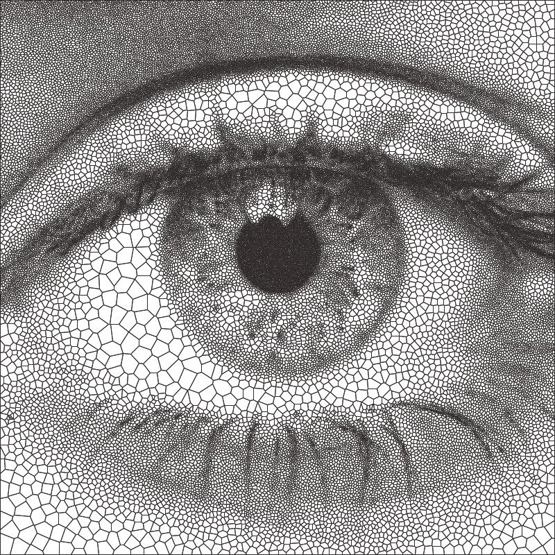

Settings
----------

Voronoi Style
^^^^^^^^^^^^^^^^^^^^^^

.. glossary::

 Voronoi Style

    ``Values: Classic | Smooth | Sharp | Offset A | Offset B | Offset C``

    - **Classic** - The default and original Voronoi Diagram
    - **Smooth** - A smoother version of the original, creating rounded cells which can be more visually pleasing.
    - **Sharp** - A more jagged / stylised version
    - **Offset A, B, C** - Less detailed / stylised version using the different offsets of adjacent triangles

**+ Inherits settings from:**
    - `Default Adaptive PFM Settings`_

----

Adaptive TSP
======================================
Transforms an image into a single continuous line, or alternatively multiple individual continuous line segments.

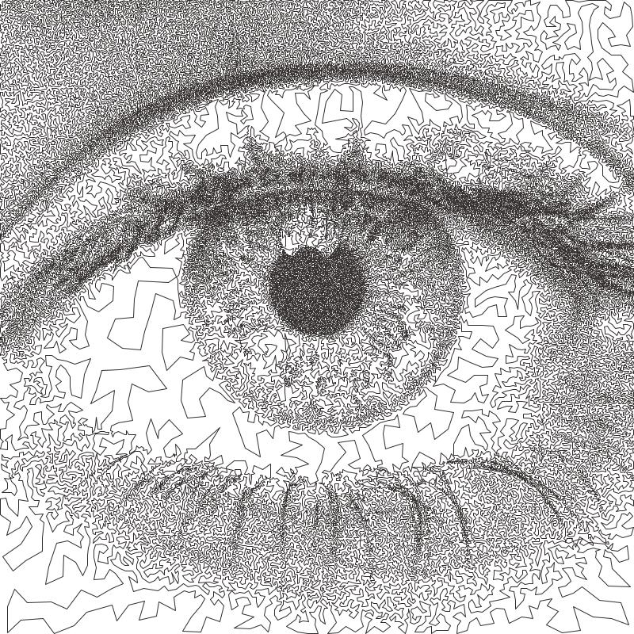

Settings
----------

TSP
^^^^^^^^^^^^^^^^^^^^^^

.. glossary::

 Merge TSP Paths

    ``Values: Boolean (True | False)``

    When **True**, the PFM will create one continuous line without any pen lifts.

    When **False**, the individual TSP segments will not be joined and will each be drawn as separate shapes.

**+ Inherits settings from:**
    - `Default Adaptive PFM Settings`_

********************
LBG PFMs
********************

LBS (Linde Buzo Gray) PFMs combine the speed of Adaptive PFMs with the Quality of Voronoi PFMs and in most cases will outperform both in detail retention. They also respond better to large variations in stipple spacing.

Default LBG Settings
=============================================

LBG Sampling
---------------

.. glossary::

 Stipple Radius Min/Max

    ``Values: Number (Safe Range: 1.0 -> 100.0)``

    The spacing between each sample point generated.

 Density

    ``Values: Number (Safe Range: 0.0 -> 100.0)``

    The mapping between Min/Max radius, giving control over the contrast of the image.

 Threshold

    ``Values: Number (Safe Range: 0.0 -> 100.0)``

    The image luminance threshold for when points should stop being generated.

 Max Iterations

    ``Values: Number (Safe Range: 1 -> 100)``

    Number of improvements to make to the LBG positions before stopping.

    Higher iterations will result in more accurate results. If no more improvements can be made the process will stop early

 Cache Result

    ``Values: Boolean (True | False)``

    When enabled, if all of the settings above have remained the same the result of the LBG Sampling will not be regenerated on the next run, which saves processing time and is very useful for PFMs like LBG Circular Scribbles.

----

LBG Circular Scribbles
======================================
Transforms an image into a single continuous circular scribble.

This is an implementation of Chiu Et Al 2015, “Tone‐ and Feature‐Aware Circular Scribble Art”. If you wish to achieve results similar to Chiu Et Al’s implementation use a size of paper, pen width which gives you a plotting size of 4000px on the largest edge then use the “Chiu Et Al – 4000px” preset

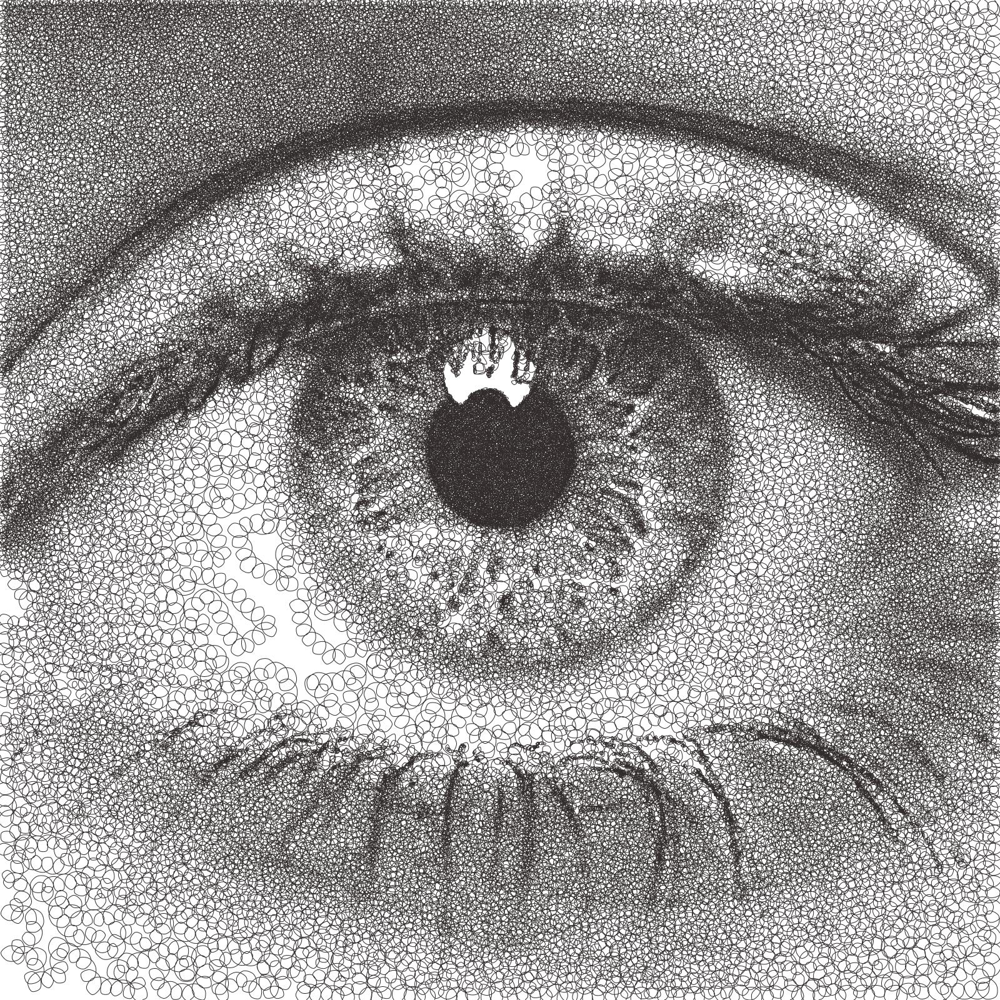

Settings
----------

**+ Inherits settings from:**
    - `Default LBG Settings`_
    - `Adaptive Circular Scribbles`_

----

LBG Shapes
======================================
Transforms an image into a series of packed shapes

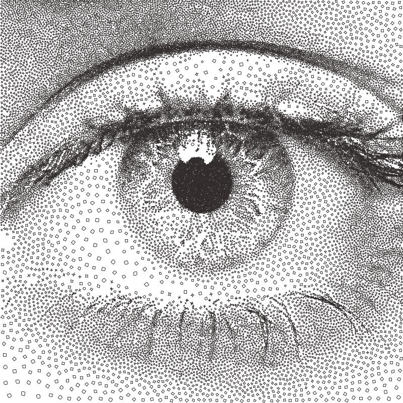

Settings
----------

**+ Inherits settings from:**
    - `Default LBG Settings`_
    - `Adaptive Shapes`_

----

LBG Triangulation
======================================
Transforms an image into a series of connected triangles joining all the points generated using `Delaunay Triangulation <https://en.wikipedia.org/wiki/Delaunay_triangulation>`_

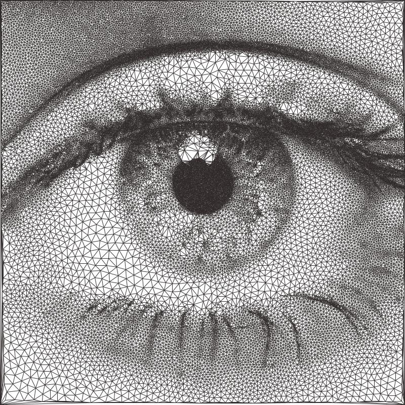

Settings
----------

**+ Inherits settings from:**
    - `Default LBG Settings`_
    - `Adaptive Triangulation`_

----

LBG Tree
======================================
Transforms an image into a Minimum Spanning Tree, which connects all the points generated into a minimum length tree.

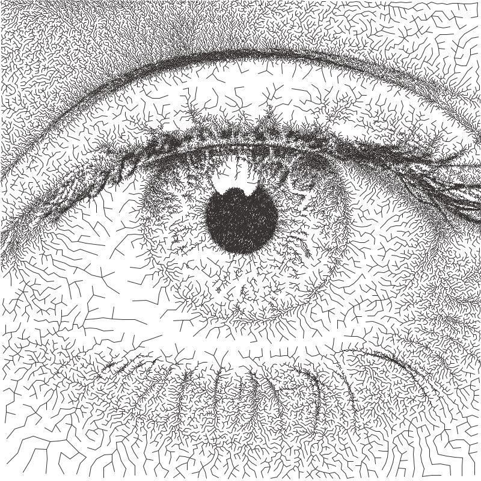

Settings
----------

**+ Inherits settings from:**
    - `Default LBG Settings`_
    - `Adaptive Tree`_

----

LBG Stippling
======================================
Transforms an image into a series of dots placed at each point generated.

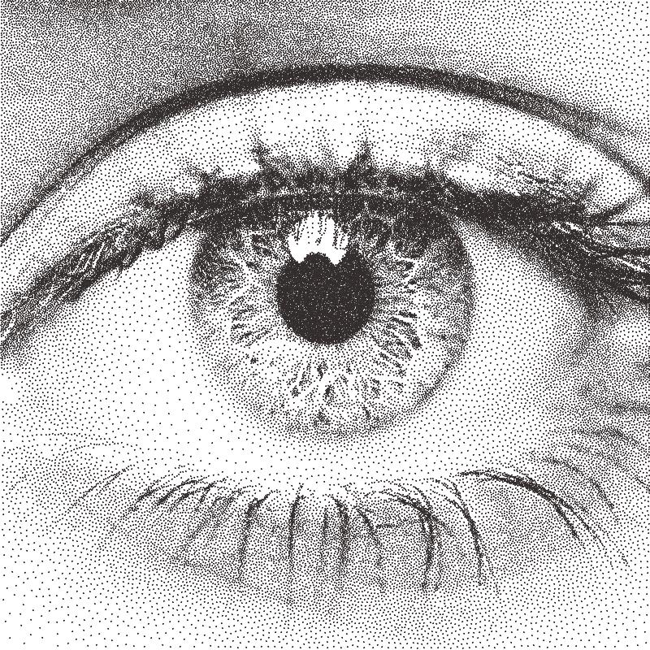

Settings
----------

**+ Inherits settings from:**
    - `Default LBG Settings`_
    - `Adaptive Stippling`_

----

LBG Dashes
======================================
Transforms an image into a series of dashes placed at each point generated.

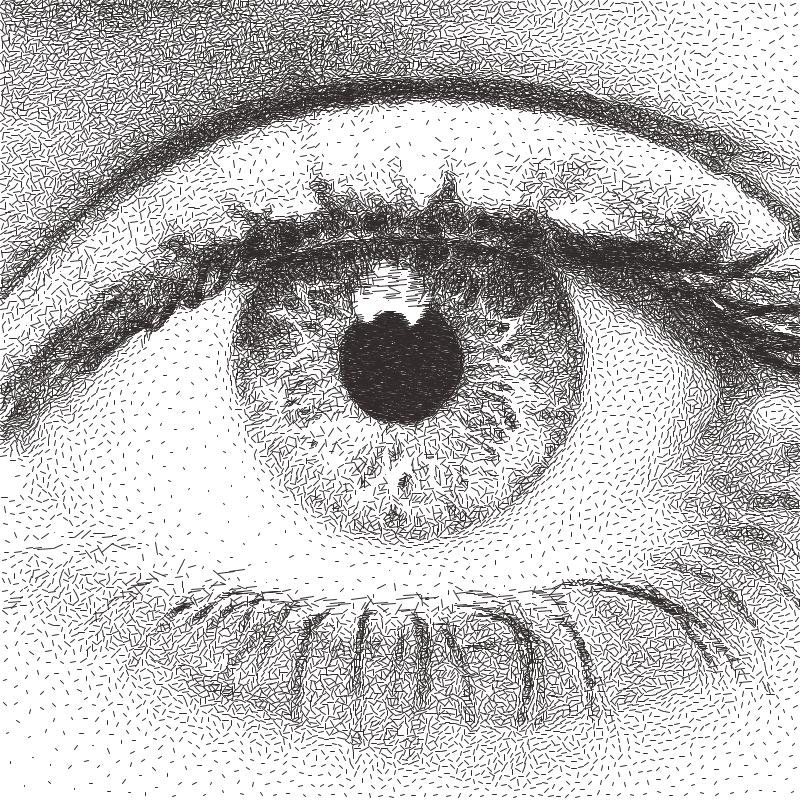

----

LBG Letters
======================================
Transforms an image into a series of letters placed at each point generated.

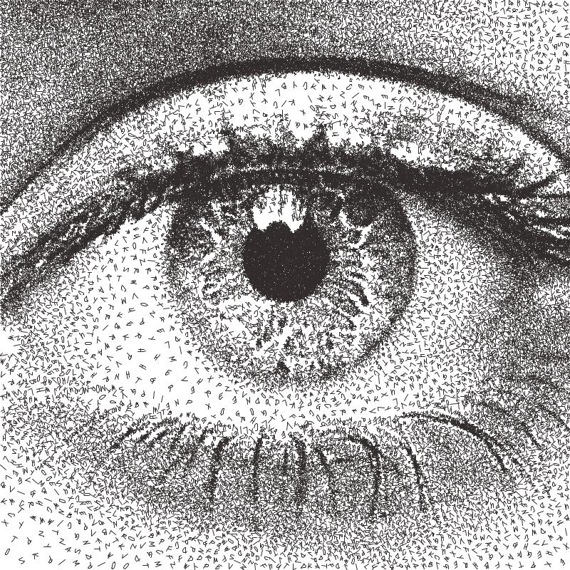

Settings
----------

**+ Inherits settings from:**
    - `Default LBG Settings`_
    - `Adaptive Letters`_

----

LBG Diagram
======================================
Transforms an image into a Voronoi Diagram which is generated from all of the evenly distributed points.

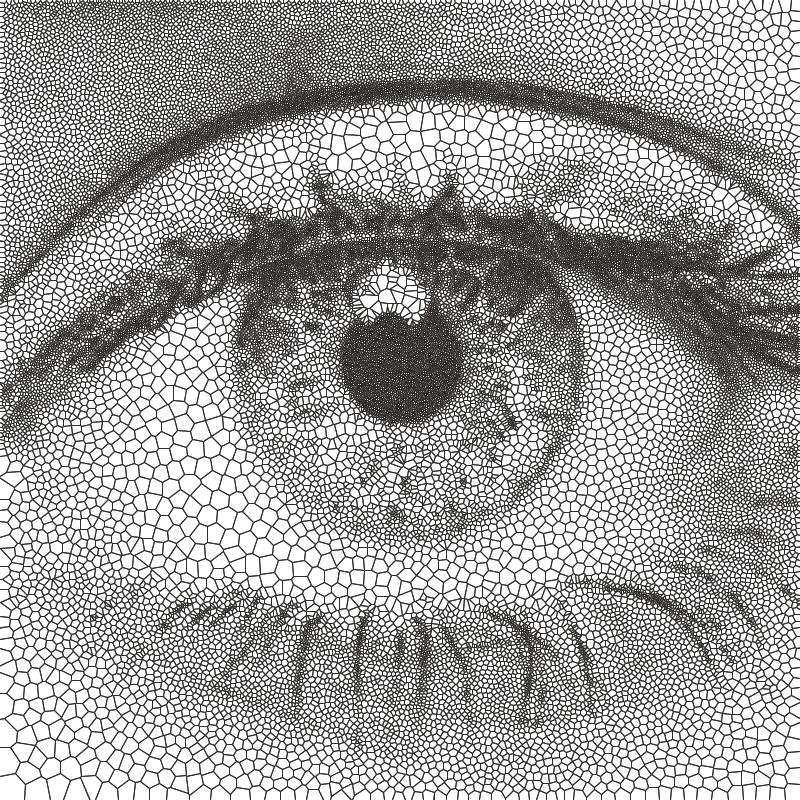

Settings
----------

**+ Inherits settings from:**
    - `Default LBG Settings`_
    - `Adaptive Diagram`_

----

LBG TSP
======================================
Transforms an image into a single continuous line, or alternatively multiple individual continuous line segments.

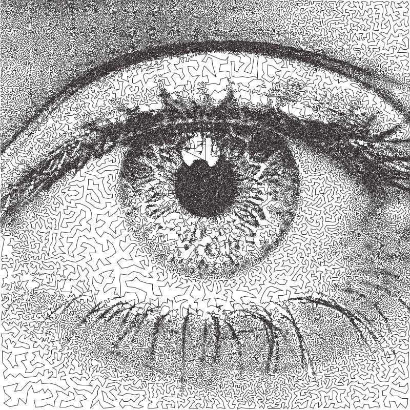

Settings
----------

**+ Inherits settings from:**
    - `Default LBG Settings`_
    - `Adaptive TSP`_

***********************
Voronoi PFMs
***********************

All Voronoi PFMs utilise a `Weighted Voronoi Diagram <https://en.wikipedia.org/wiki/Weighted_Voronoi_diagram>`_ to determine the distribution of brightness in the original image and then use this diagram to generate new styles.

How do they work?
======================================
1) Randomly scatter points over the image proportional to the images brightness
2) Calculates a voronoi diagram based on these points.
3) Calculates the weighted centroids of each cell in the diagram using brightness data.
4) Use the generated centroids to re-calculate the voronoi diagram.
5) Return to step 3

The process finishes when the specified number of **voronoi iterations** have been performed.

Default Voronoi Settings
=============================================

Voronoi Sampling
-------------------

.. glossary::

 Point Density

    ``Values: Number (Safe Range: 1 -> 1200)``

    Controls the overall density of the drawing.

    The number of generated points will be proportional to the images size. i.e. a A4 and A3 drawing with the same density would have a similar about of points

 Point Limit

    ``Values: Number (Safe Range: 0 -> 1000000)``

    Controls a hard limit for the amount of points to be generated. Only has an effect if the the number is lower than the amount that would be generated by the given Point Density
    The limit will be ignored when set to 0.

 Luminance Power (Voronoi PFMs)

    ``Values: Number (Safe Range: 1 -> 50)``

    Used when randomly scattering points over the image, it affects how biased the scattering is towards darker areas of the image, typically using the same value for Density Power yields the best results.

 Density Power

    ``Values: Number (Safe Range: 1 -> 50)``

    Used when calculating the centroids of the voronoi diagram, it affects the calculation's bias towards darker areas of the image, typically using the same value for Luminance Power yields the best results.

 Voronoi Iterations

    ``Values: Number (Safe Range: 1 -> 100)``

    How many times to re-calculate the voronoi diagram. More iterations will result in a more accurate representation of the original image.

 Voronoi Accuracy

    ``Values: Number (Safe Range: 1 -> 100)``

    Controls the quality of the voronoi calculation, decreases processing times.

 Ignore White (Voronoi PFMs)

    ``Values: Boolean (True | False)``

    When **True**, the PFM will filter out points in white areas of the image.

----

Voronoi Shapes
======================================
Transforms an image into a series of inscribed shapes for each cell of the voronoi diagram.

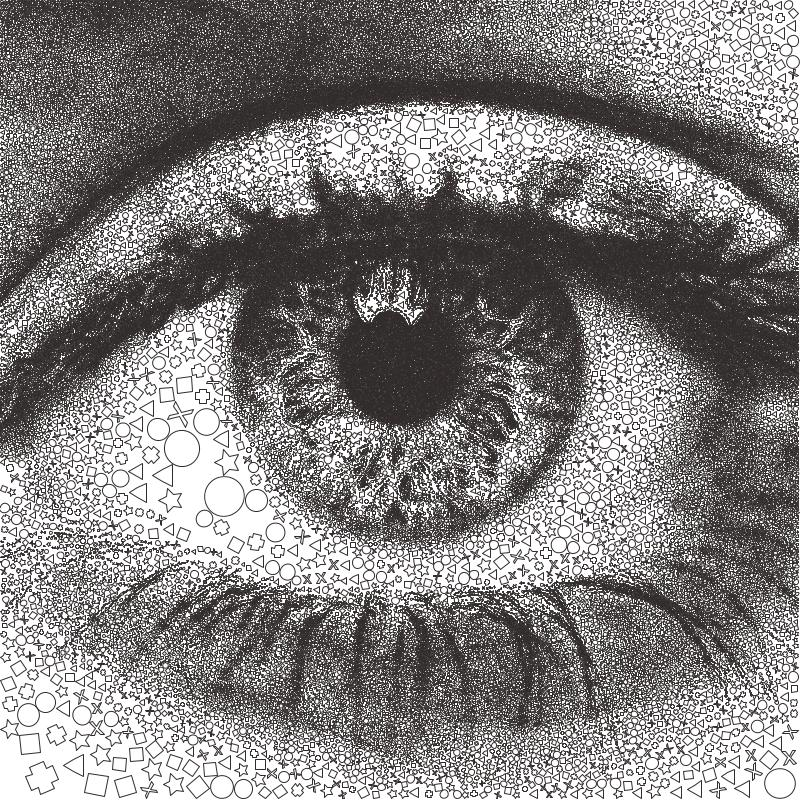

Settings
----------

**+ Inherits settings from:**
    - `Default Voronoi Settings`_
    - `Adaptive Shapes`_

----

Voronoi Triangulation
======================================
Transforms an image into a series of connected triangles joining all the *centroids* in the voronoi diagram using `Delaunay Triangulation <https://en.wikipedia.org/wiki/Delaunay_triangulation>`_

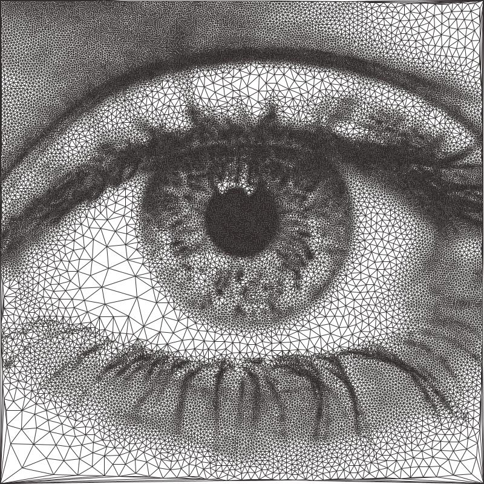

Settings
----------

**+ Inherits settings from:**
    - `Default Voronoi Settings`_
    - `Adaptive Triangulation`_

----

Voronoi Tree
======================================
Transforms an image into a Minimum Spanning Tree, which connects all the *centroids* in the voronoi diagram into a minimum length tree.

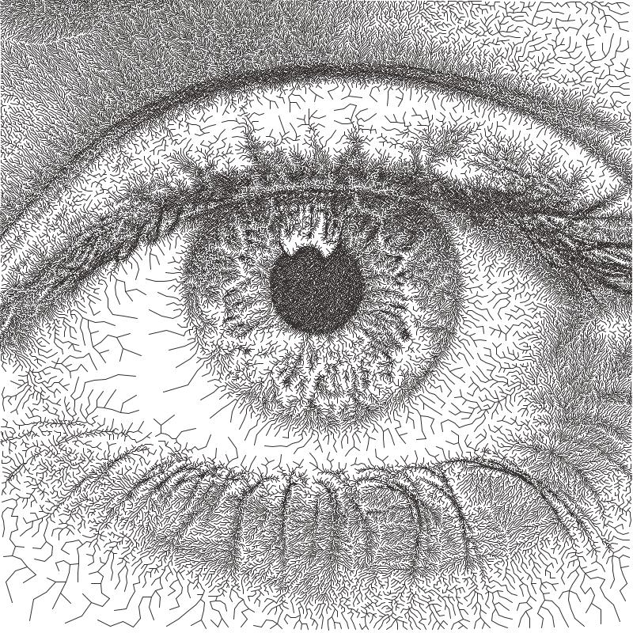

Settings
----------

**+ Inherits settings from:**
    - `Default Voronoi Settings`_
    - `Adaptive Tree`_

----

Voronoi Stippling
======================================
Transforms an image into a series of filled circles for each *centroid* in the voronoi diagram, the size of the "stipple" is relative to the sampled brightness of the cell the centroid belongs to.

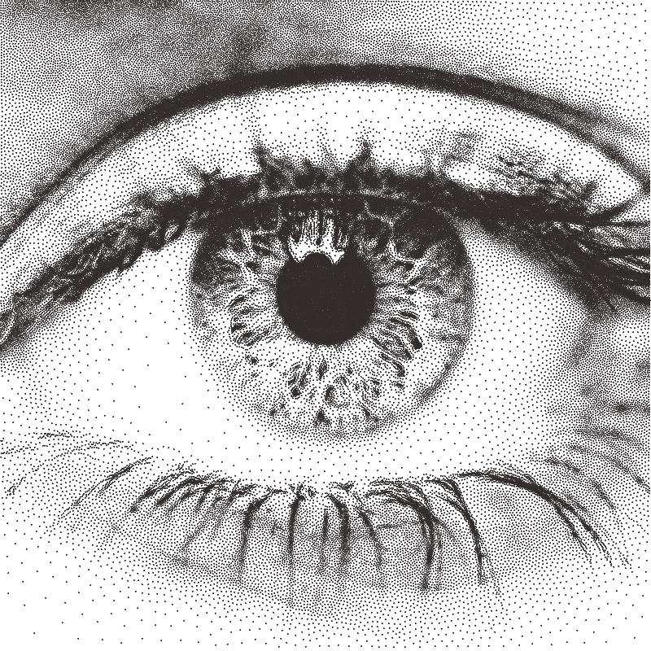

Settings
----------

**+ Inherits settings from:**
    - `Default Voronoi Settings`_
    - `Adaptive Stippling`_

----

Voronoi Dashes
======================================
Transforms an image into a series of dashes at each *centroid* in the voronoi diagram.

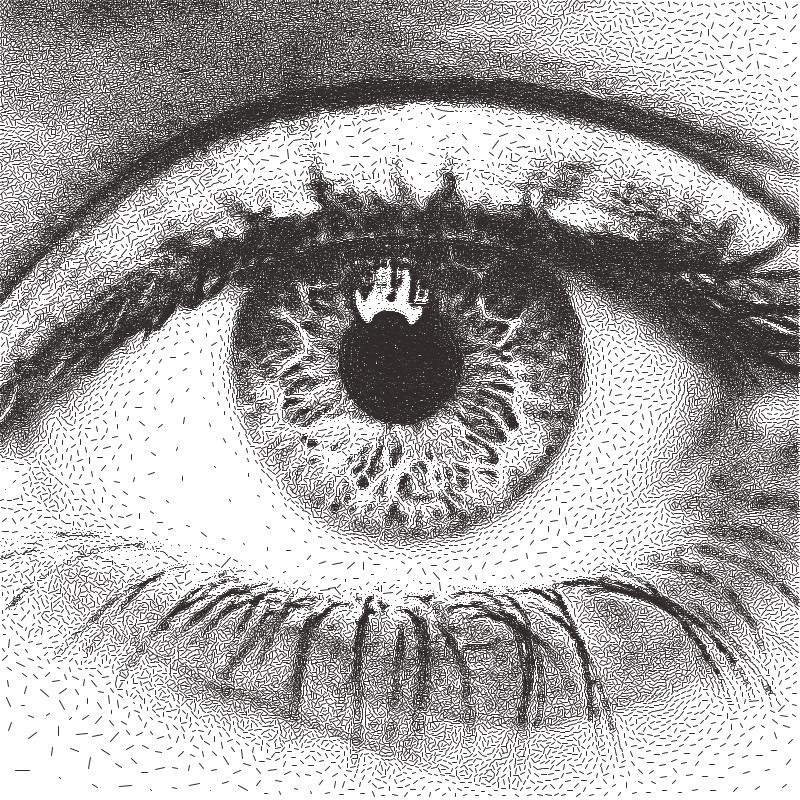

Settings
----------

**+ Inherits settings from:**
    - `Default Voronoi Settings`_
    - `Adaptive Dashes`_

----

Voronoi Diagram
======================================
Transforms an image into a Voronoi Diagram.

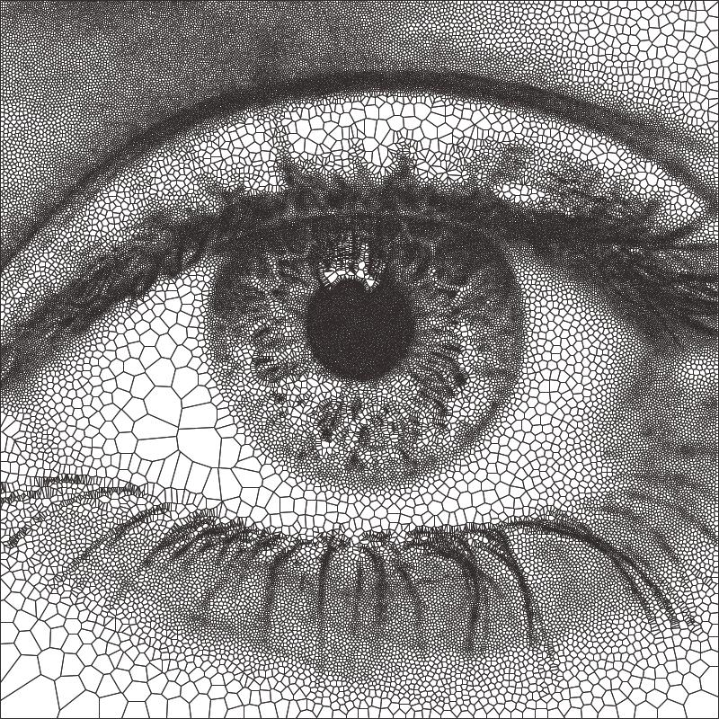

Settings
----------

**+ Inherits settings from:**
    - `Default Voronoi Settings`_
    - `Adaptive Diagram`_

----

Voronoi TSP
======================================
Transforms an image into a series of connected lines for each *centroid* in the voronoi diagram with the shortest distance. By solving the Travelling Salesman Problem.

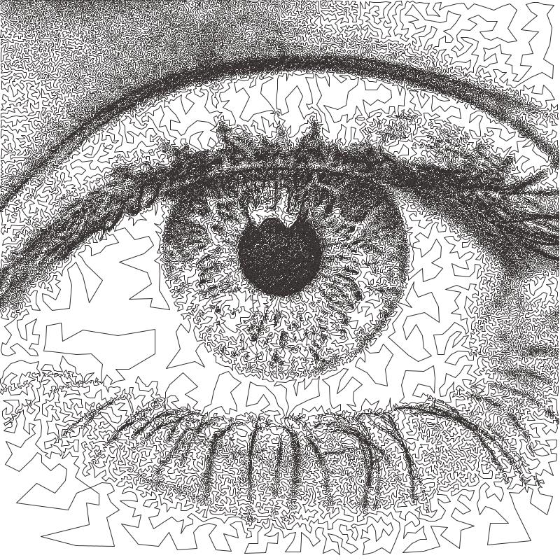

Settings
----------

**+ Inherits settings from:**
    - `Default Voronoi Settings`_
    - `Adaptive TSP`_

********************
Grid PFMS
********************

Grid PFMs create styles using a grid, great for creating some classic half-tone drawing styles but also much more stylised drawings where the grid is only a starting point and the points may diverge away from it.

They work especially well with :ref:`cmyk-separation` and :ref:`colour-match`

They also process very quickly due to the simplicity of generating the starting grid.

**Quick Tip:** Grid PFMs often work better with thicker pens 0.5mm + as this helps to introduce contrast to the grid.

Default Grid PFM Settings
===================================

Grid
----------------

.. glossary::

 Uniform Spacing

    ``Values: Boolean (True | False)``

    When **True**, the Grid Spacing will be the same on both the X & Y Axis and the :term:`Grid Y Spacing` variable will be locked.

    When **False**, the :term:`Grid X Spacing` and :term:`Grid Y Spacing` can be different.

 Grid X Spacing

    ``Values: Number (Safe Range: 1.0 -> 32.0)``

    Controls the number of columns in the grid.

 Grid Y Spacing

    ``Values: Number (Safe Range: 1.0 -> 32.0)``

    Controls the number of rows in the grid, only usable if :term:`Uniform Spacing` is **False**.

 Shape Scale

    ``Values: Number (Safe Range: 0.01 -> 4.0)``

    Controls the shape of the generated Shapes, a value of 1.0 will occupy all the available space in the grid.

    Values higher than 1.0 will use more than the available space and cause shapes to overlap.

    Values lower than 1.0 will use less than the available space.

 Rand Offset X/Y

    ``Values: Number (Safe Range: 0.0 -> 64.0)``

    Introduces a random X/Y offset to each grid position, introducing some natural noise to the grid.

    With values higher than 0, the grid positions will no longer be uniform.

 Interleave

    ``Values: Boolean (True | False)``

    When **True**, every odd row will be offset by the grid spacing, creating interlocking grid points.

    When **False**, the grid will be uniform.

Grid Style
----------------

.. glossary::

 Brightness (Grid PFMs)

    ``Values: Number (Safe Range: 0.0 -> 2.0)``

    Controls the brightness applied as a pre-processing step to the source image, see :term:`Brightness (Adaptive PFMs)`

 Contrast (Grid PFMs)

    ``Values: Number (Safe Range: 0.0 -> 2.0)``

    Controls the contrast applied as a pre-processing step to the source image.

    The quality of Drawings from Grid PFMs can vary massively on the contrast and brightness so these controls are included for simplicity though they behave the same as adding a contrast filter in the Pre-Processing tab.

 Threshold (Grid PFMs)

    ``Values: Number (Safe Range: 0.0 -> 100.0)``

    Controls the cut-off luminance to stop generating grid points. Lowering the Threshold will prevent points being drawn in bright areas of the image.

 Threshold Feather

    ``Values: Number (Safe Range: 0.0 -> 100.0)``

    Controls a dithering process applied when a Threshold has been introduced.

    When the Feather is 0 the threshold will be a hard cut-off, due to the linear nature of the grid this can become quite obvious with some settings / image combinations.

    In these situations introducing a feather will add some randomness to if points are drawn or not, resulting in more gradual cut-off.

 Concentric Fills

    **(Grid Shapes / Letters Only)**

    ``Values: Boolean (True | False)``

    When **True**, the generated shapes will be filled entirely with the pen, a continuous fill consisting of progressively smaller shapes will be generated, this is useful for introducing some more tone/contrast into the final drawing.

    When **False**, no fills will be generated.

    .. image:: images/grids/concentric_fills_comparison_v1.jpg
        :width: 300pt

 Convergence

    ``Values: Percentage (Range: 0.0 -> 100.0)``

    Causes grid points to converge towards the darkest areas of the image making the grid no longer uniform but having the effect of emphasising edges and contrast in the image.

    This is great for creating stylised results and is used in many of the default grid presets.

    .. image:: images/grids/convergence_comparison_v1.jpg
        :width: 450pt

    *Fig 1. Convergence = 0, Fig 2. Convergence = 50, Fig 3. Convergence = 100*

Grid Shapes
======================================

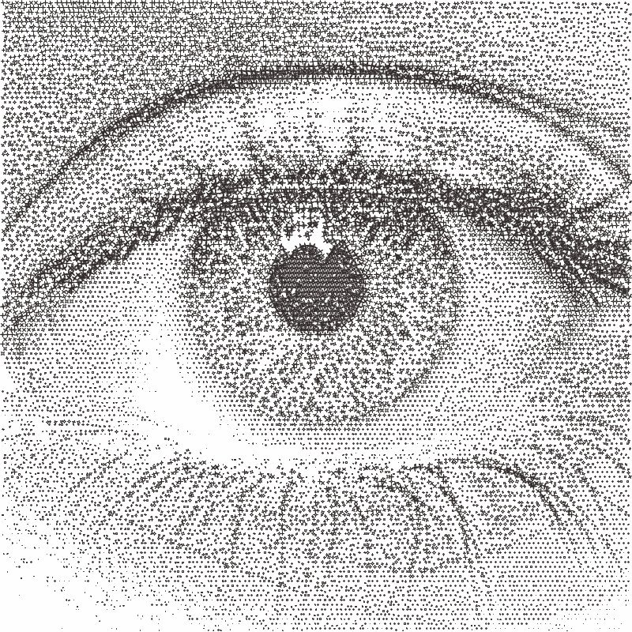

**+ Inherits settings from:**
    - `Default Grid PFM Settings`_
    - `Adaptive Shapes`_

Grid Dashes
======================================

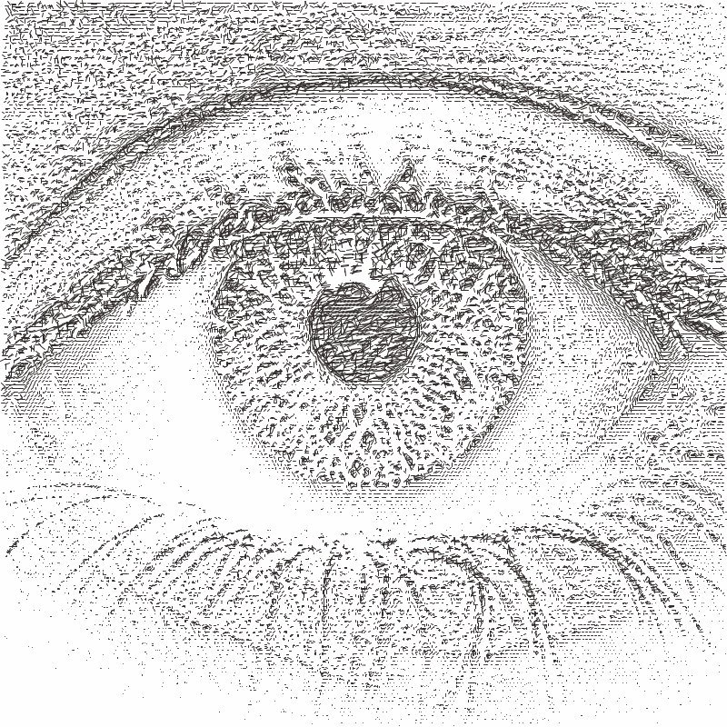

**+ Inherits settings from:**
    - `Default Grid PFM Settings`_
    - `Adaptive Dashes`_

Grid Letters
======================================

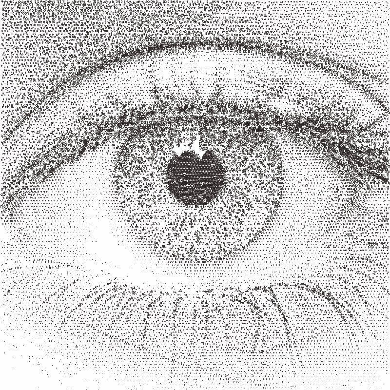

**+ Inherits settings from:**
    - `Default Grid PFM Settings`_
    - `Grid Shapes`_
    - `Adaptive Letters`_

********************
Composite PFMS
********************

Composite PFMs offer different ways to combine multiple PFMs together to create new styles.

Default Composite PFM Settings
===================================

Drawing Styles
----------------

.. glossary::

 Drawing Styles

    ``Values: Special``

    A configurable list of Drawing Styles.

    A **Drawing Style** consists of a Path Finding Module and a Drawing Set. When run the PFM will be run with the given Drawing Set and added to the final drawing.

    Upon clicking the "Drawing Styles" button in the PFM Settings you'll be presented with this window.

    .. image:: images/composite/drawing_styles_ui.png
        :width: 300pt

    Here you can configure the Composite PFM's enabled Drawing Styles. You may add as many Styles as you wish and by selecting each one in the list on the left of the window you can configure the settings of the Path Finding Module on the right.

    - *Name*
        Defaults to the selected PFM, but can be changed by the user.

    - *Weight*
        *Only visible for specific Composite PFMs*

        Typically the selection of PFMs for the various tiles of the mosaic is random and the random selections can be changed with the :term:`Random Seed`.

        However, when the weight is changed, the random selection will be weighted (similar to pen weights) and the number of tiles in the mosaic drawn in that style will be proportional to its weight.

    - *Drawing Set:*
        The selected Drawing Set. Change it by double clicking the current value. To create more Drawing Sets see **Drawing Slots** at the bottom of the Pen Settings tab.

    Note: It's also possible to stack multiple composite PFMs inside each other, when Composite PFMs are stacked selecting the "Drawing Styles" button will open another identical window, but the title of the window will change, indicating where in the chain of PFMs you currently are. This should be considered an Experimental feature and may result in crashes due to the complexity of deep stacks of mosaic pfms.

 Draw Outlines

    **(for Mosaic PFMs only)**

    ``Values: Boolean (True | False)``

    When **True**, the shapes used to generate the mosaic will also be output as Shapes, giving each Mosaic Cell/Tile a sharp outline.

----

Mosaic Rectangles
======================================
Divides an image into a series of rectangles which can are then distributed randomly amongst the enabled Drawing Styles

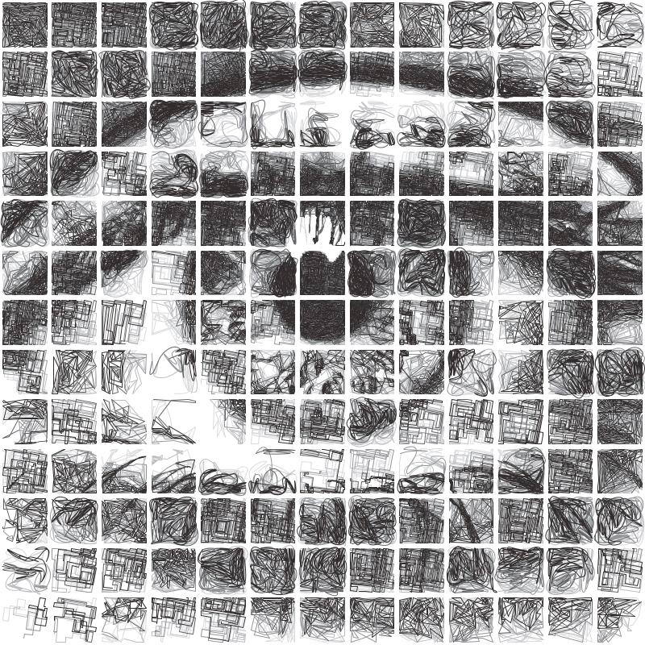

Settings
----------

Tiles
^^^^^^^^^^^^^^^^^^^^^^

.. glossary::

 Square Tiles

    ``Values: Boolean (True | False)``

    When **True**, instead of rectangles the PFM will only produce Squares, the row & row padding sliders will be disabled.

 Columns

    ``Values: Number (Safe Range: 1 -> 64)``

    Controls the number of columns along the x axis and therefore affects the total number of tiles in the mosaic.

 Rows

    ``Values: Number (Safe Range: 1 -> 64)``

    Controls the number of rows along the y axis and therefore affects the total number of tiles in the mosaic.

 Column Padding %

    ``Values: Percentage (Range: 1 -> 100)``

    Controls the border of the rectangle on the left and right as a percentage of the tiles width.

 Row Padding %

    ``Values: Percentage (Range: 1 -> 100)``

    Controls the border of the rectangle on the top and bottom as a percentage of the tiles height.

----

Mosaic Voronoi
======================================
Divides an image into a Voronoi Diagram, each cell is distributed randomly amongst the enabled Drawing Styles.

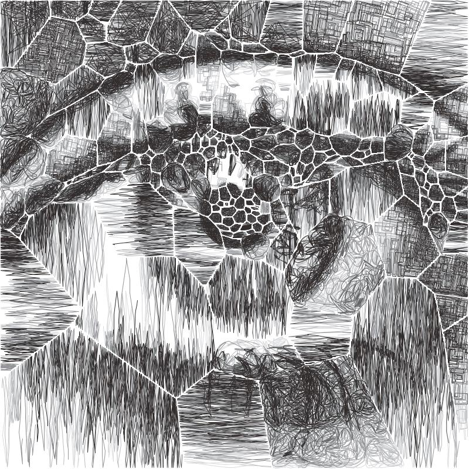

Settings
----------

Tiles
^^^^^^^^^^^^^^^^^^^^^^

.. glossary::

 Tile Count (Mosaic Voronoi)
    ``Values: Number (Range: -20 -> 20)``

    Controls the number of Voronoi Tiles to generate / how many times to split the input image.

 Offset Cells
    ``Values: Percentage (Range: -20 -> 20)``

    Shifts the border of the generated Voronoi Tiles. Negative values will shrink the cell, positive values will grow the cell.
    Note: Negative values may result in nothing being drawn in cells if they become too small.

**+ Inherits settings from:**
    - `Default Composite PFM Settings`_
    - `Default Voronoi Settings`_

----

Mosaic Triangulation
======================================

Divides an image into a Mosaic using Delaunay Triangulation. Each triangle is distributed randomly amongst the enabled Drawing Styles.

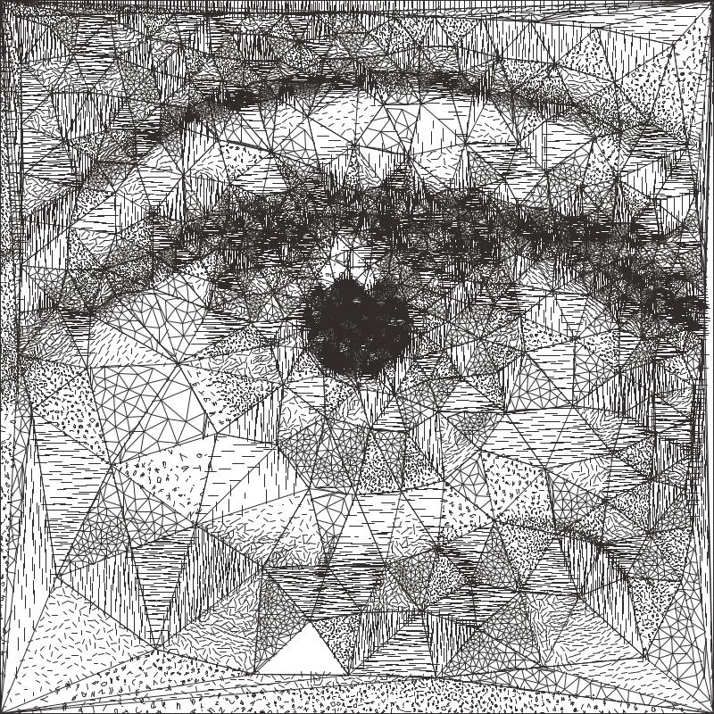

Settings
----------

**+ Inherits settings from:**
    - `Default Composite PFM Settings`_
    - `Mosaic Voronoi`_
    - `Default Voronoi Settings`_
    - `Adaptive Triangulation`_

----

Mosaic Segments
======================================

Generates a mosaic out of detailed segments using Simple Linear Iterative Clustering (SLIC Image Segmentation), the shapes it generates represent the shapes present in the original drawing much more accurately that Mosaic Voronoi.

Generating accurate segments means this PFM will pause for up to 20 seconds before processing.

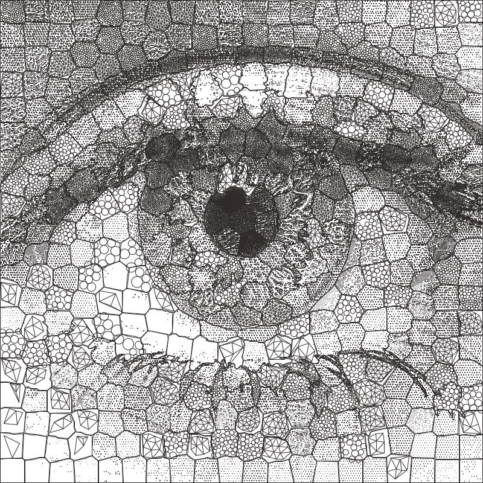

Settings
----------

Segments
^^^^^^^^^^^^^^^^^^^^^^

.. glossary::

 Segments
    ``Values: Number (Safe Range: 1 -> 5000)``

    Controls the total number of segments to generate with SLIC Image Segmentation. Higher values will take longer to process and may crash for certain images / computers.

 Iterations
    ``Values: Number (Safe Range: 1 -> 100)``

    Controls the accuracy of the SLIC Image Segmentation, more iterations = longer processing time, more accurate segments.

 Compactness
    ``Values: Number (Safe Range: 1 -> 100)``

    Adjusts the outline of the segments generated, high values = flatter cells, formed of straight lines, low values = messy cells, with rough outlines

**+ Inherits settings from:**
    - `Default Composite PFM Settings`_
    - `Mosaic Voronoi`_

----

Mosaic Custom
======================================

Note: Mosaic Custom is under revision

----

Layers PFM
======================================

Layers all of the Drawing Styles on top of each other, with each Style being run once and covering the entire image.

The Drawing Styles are layered in the order they are listed in the Drawing Styles menu.

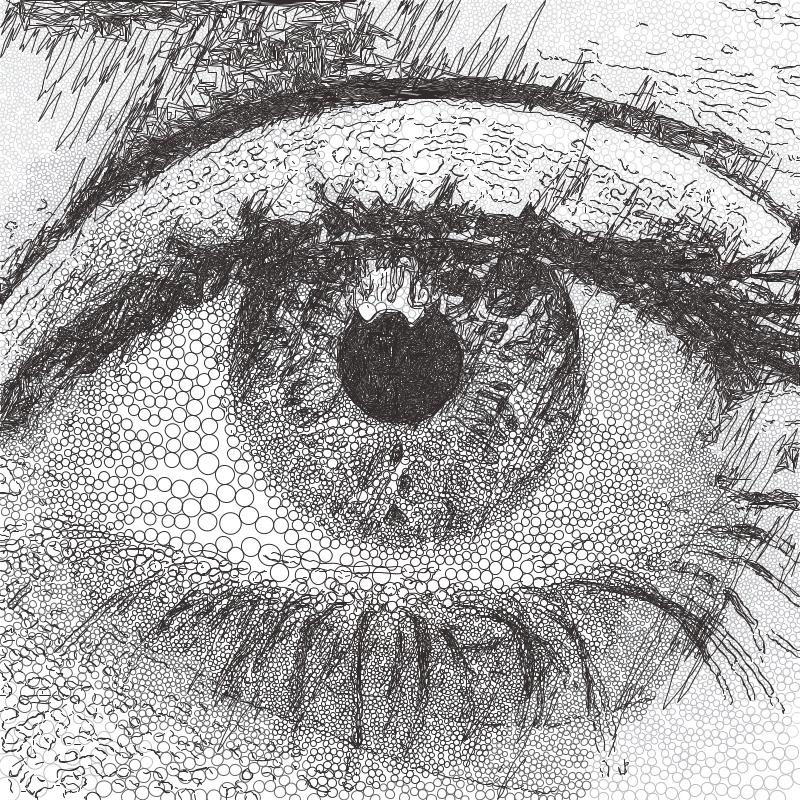

Settings
----------

Layers
^^^^^^^

.. glossary::

 Keep Lightened Image

    ``Values: Boolean (True | False)``

    When **True**, the Layers PFM will take the *Lightened Image* (see __`Erasing` for more details) at each stage in the plotting process and pass it onto the next PFM.

    The *Lightened Image* is typically only used by Sketch PFMs, , so if you are layering multiple Sketch PFMs enabling this option will limit the amount of overlap as each Sketch PFM will essentially start where the last finished. If you have other types of PFMs layered after a Sketch PFM with **Keep Lightened Image** enabled their outputs will also be affected.

 Layer Distribution

    ``Values: NONE | ORDERED PER PFM | ORDERED``

    Which allows finer control over the distribution of pens between layers
        - **NONE:** Layers will be distributed separately.
        - **ORDERED PER PFM:** Layers which use the same PFM and Drawing Set will be distributed together, treating the first layer as the darkest and the last layer as the brightest.
        - **ORDERED:** Same as the above, but only distributes matches Drawing Sets and ignores the used PFM.

**+ Inherits settings from:**
    - `Default Composite PFM Settings`_

********************
Special PFMS
********************

ECS Drawing
======================================

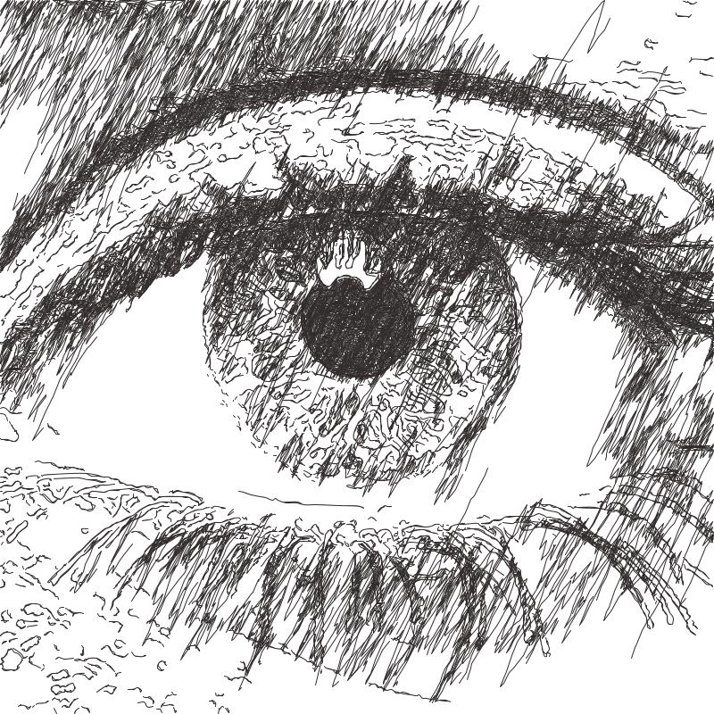

Settings
----------

Edges
^^^^^^^^^^^^^^^^^^^^^

.. glossary::

 Draw Edges

    ``Values: Boolean (True | False)``

    Disables/Enables edge detection.

 Edge Blur

    ``Values: Number (Safe Range: 0 -> 50)``

    Affects the pre-filter blur applied before edges are detected. Higher edge blur will result in less edges but the edges will be smoother.

 Edge Detail

    ``Values: Number (Safe Range: 0 -> 255)``

    Controls the amount of edges which are generated: lower detail -> less edges : higher detail -> more edges.

 Edge Simplify

    ``Values: Number (Safe Range: 0 -> 100)``

    Simplifies the generated edges, removing unnecessary vertices.

 Edge Distortion

    ``Values: Number (Safe Range: 0 -> 100)``

    Introduces noise to the generated edges, giving them a rougher more inaccurate appearance.

Contours
^^^^^^^^^^^^^^^^^^^^^

.. glossary::

 Draw Contours

    ``Values: Boolean (True | False)``

    Disables/Enables contour detection.

 Contour Blur

    ``Values: Number (Safe Range: 0 -> 99)``

    Similar to Edge Blur but for contours. Has a greater impact on the amount of contours and quality of the contours.

 Contour Detail

    ``Values: Number (Safe Range: 0 -> 255)``

    Controls the amount of contours which are generated: lower detail -> less contours : higher detail -> more contours.

 Contour Simplify

    ``Values: Number (Safe Range: 0 -> 100)``

    Simplifies the generated contours, removing unnecessary vertices.

 Contour Distortion

    ``Values: Number (Safe Range: 0 -> 100)``

    Introduces noise to the generated contours, giving them a rougher more inaccurate appearance.

Shading (ECS Drawing)
^^^^^^^^^^^^^^^^^^^^^^^^

.. glossary::

 Draw Shading

    ``Values: Boolean (True | False)``

    Disables/Enables shading. The shading component uses a simplified version of the Sketch Lines shading feature, you may choose to disable the shading entirely and overlay another Sketch PFM using PFM Layers.

 Shading Accuracy

    ``Values: Number (Safe Range: 0 -> 100)``

    Controls the accuracy of the shading: lower -> less accurate, more stylised : higher -> more accurate, less stylised

 Shading Detail

    ``Values: Number (Safe Range: 0 -> 100)``

    Controls the luminance at which shading will be stopped: lower -> less shading : higher -> more shading

 Shading Length

    ``Values: Number (Safe Range: 0 -> 150)``

    Controls the maximum length of the lines which make up the shading.

----

SVG Converter
======================================

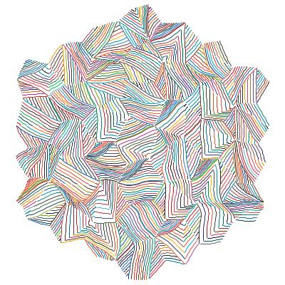

Settings
----------

Shape
^^^^^^^^^^^

.. glossary::

 SVG Path

    ``Values: SVG File Path``

    The path to the SVG to be used. If this isn't set it will use the current imported SVG, if there isn't one the PFM will produce no output. You can use this PFM as part of a Layers PFM, to layer SVGs together, when you run the PFM like this you can set the SVG Path to use an SVG which hasn't been imported.

 Shape Clipping

    ``Values: Boolean (True | False)``

    When enabled Solid Shapes will "clip" the shapes below, meaning if a shape is covered by another in the SVG only the visible part will be drawn, this only occurs for solid shapes, individual lines won't clip the shapes below.

 Derive Drawing Set

    ``Values: Boolean (True | False)``

    When **True**, a new Drawing Pen will be generated for each colour in the SVG, allowing you to access them each as layers. This opens up possibilities for splitting SVGs by colour using a per/layer export, or even re-assigning colours to your SVG, once the SVG Converter PFM has been run you'll have access to change the colour of lines with all the tools available with a default drawing.

Hatch Fill
^^^^^^^^^^^

If shapes in the SVG have solid fills, hatch fills will be used instead which can easily be drawn by a pen plotter

.. glossary::

 Shape Filling (Hatch Fill)

    ``Values: Boolean (True | False)``

    When enabled Hatch Fills will be generated.

 Spacing (Hatch Fill)

    ``Values: Number (Safe Range: 1 -> 10)``

    The distance between the hatch lines. This is relative to the pen width so a spacing of 1.0 will draw over the entire shape with no gaps, a spacing of 2.0 will leave spaces the same width as the pen.

 Min/Max Rotation (Hatch Fill)

    ``Values: Number (Safe Range: 0 -> 360)``

    Controls the rotation of the generated hatch lines

 Link Ends (Hatch Fill)

    ``Values: Boolean (True | False)``

    Links the resulting hatch lines to create one continuous line (for some shapes this may not always be possible)

 Crosshatch (Hatch Fill)

    ``Values: Boolean (True | False)``

    Creates an additional set of perpendicular Hatch Lines

Video Tutorial
--------------------

.. youtube:: Bg8BtUWhoJc

----

Pen Calibration
======================================

Generates Pen Calibration tests which can be used to select the most accurate nib size for "Rescale to Pen Width". Choose a suitable Nib Size range for the pen you wish to test and then plot the test. Then set your Pen Width for future plots with that pen to the highest nib size which has no gaps between the lines.

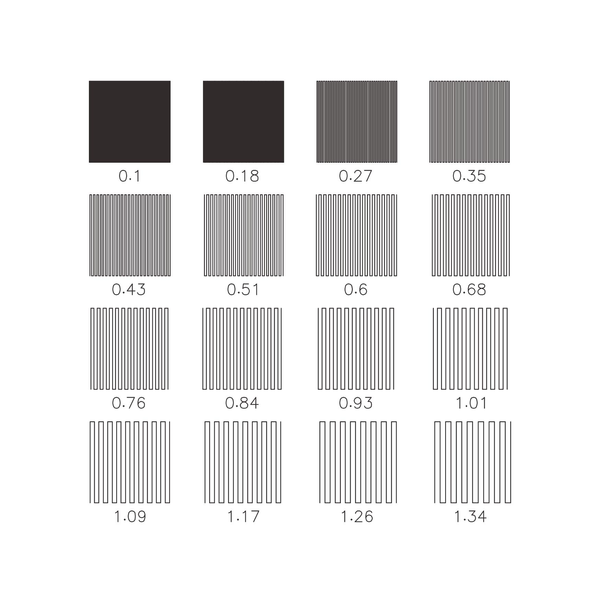

Settings
----------

Layout
^^^^^^^^

.. glossary::

 Nib Size Min

    ``Values: Number (Safe Range: 0.1 -> 2.0)``

    The smallest nib size to test.

 Nib Size Max

    ``Values: Number (Safe Range: 0.1 -> 2.0)``

    The largest nib size to test. If your pen is larger than 2.0, enter the value manually in the text field.

 Test Count

    ``Values: Number (Safe Range: 0 -> 2.0)``

    The number of calibration tests to run.

 Test Size

    ``Values: Number (Safe Range: 10.0 -> 40.0)``

    The width/height in mm of each nib size test.

 Spacing X/Y

    ``Values: Number (Safe Range: 0 -> 40.0)``

    The grid spacing in mm between each test in the grid.

 Rotation

    ``Values: Number (Safe Range: 0 -> 360.0)``

    Controls the angle of the lines in the generated line tests.

 Line Tests

    ``Values: Boolean (True | False)``

    Generates simple hatches line tests.

 Circle Tests

    ``Values: Boolean (True | False)``

    Generates concentric circle tests.

Text
^^^^^^^^

.. glossary::

 SVG Font (Pen Calibration)

    ``Values: SVG Font``

    The SVG Font to use to draw the labels for each nib size test.

 Title

    ``Values: Text``

    An optional title to draw at the top of page, you can leave this blank to have no title.

 Font Size

    ``Values: Number (Safe Range: 1.0 -> 8.0)``

    The height in mm of the label/title text.
