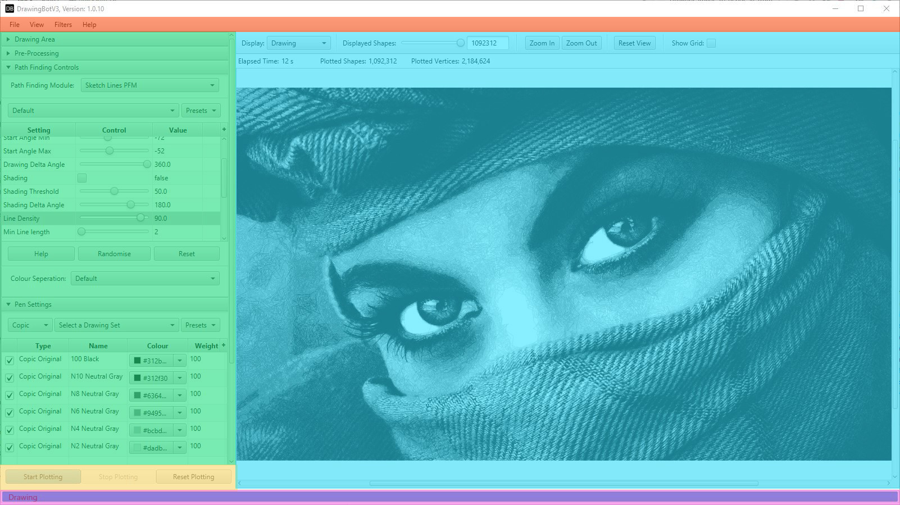

.. _user-interface:

======================
User Interface
======================

This is a quick reference guide to areas of the user interface.

.. raw:: html

    

.. role:: toolbar
.. role:: settings
.. role:: viewport
.. role:: controls
.. role:: progress

:toolbar:`Toolbar`
^^^^^^^^^^^^^^^^^^^^^^^^^^^^^^^^^^^^

The toolbar gives you access to commonly used functions like importing / exporting. You can control which `Settings Panel`_ is are currently open with the *View* Menu. You can also add Image Filters from the toolbar and configure the :ref:`export-settings`

:settings:`Settings Panel`
^^^^^^^^^^^^^^^^^^^^^^^^^^^^^^^^^^^^

This area is split into multiple sections which each control different elements of the drawing

- :ref:`drawing-area`
- :ref:`pre-processing`
- :ref:`Path Finding Controls <pfms>`
- :ref:`pen-settings`
- :ref:`version-control`
- :ref:`mask-settings`
- :ref:`batch-processing`

:viewport:`Viewport`
^^^^^^^^^^^^^^^^^^^^^^^^^^^^^^^^^^^^

The viewport will show you a live preview of the current drawing, all the controls in this area, are **visual only** and will not affect the exported drawing. You can also drag + drop an image file here to import it. It has the following buttons.

**Display**:

- Image: Displays the filtered image, after resizing / pre-processing
- Drawing:
- Original: Displays the original source image.
- Reference: Displays the reference image being used by the Path Finding Module after it's inbuilt pre-processing has been applied.
- Lightened: Displays the image which has altered by the Path Finding Module, some modules will not alter the image.
- Selected Pen: Displays only the pen which is currently highlighted in the Pen Settings table.

**Displayed Shapes**:  Allows you to display only shapes in the specified range, currently has no effect on the final output.

**Zoom In**: Increases the render size of the viewport

**Zoom In**: Decreases the render size of the viewport

**Zoom In**: Resets the render size of the viewport

**Show Grid**: Shows a reference grid to show the sizing of the image, *currently disabled*.

:controls:`Plotting Controls`
^^^^^^^^^^^^^^^^^^^^^^^^^^^^^^^^^^^^

This area allows you to control the plotting process with the following buttons.

- **Start Plotting**: Begins the plotting process.
- **Stop Plotting**: Stops the plotting process **gracefully**, meaning the current :ref:`pfms` will stop at the end of it's current process and save the drawing progress so far.
- **Reset Plotting**: Stops the plotting process **forcefully**, meaning the process will stop instantly and the drawing will be cleared

:progress:`Progress Bar`
^^^^^^^^^^^^^^^^^^^^^^^^^^^^^^^^^^^^

This area will show status updates for the current task and its progress. This will be active while a drawing is being plotted / exported / rendered.

